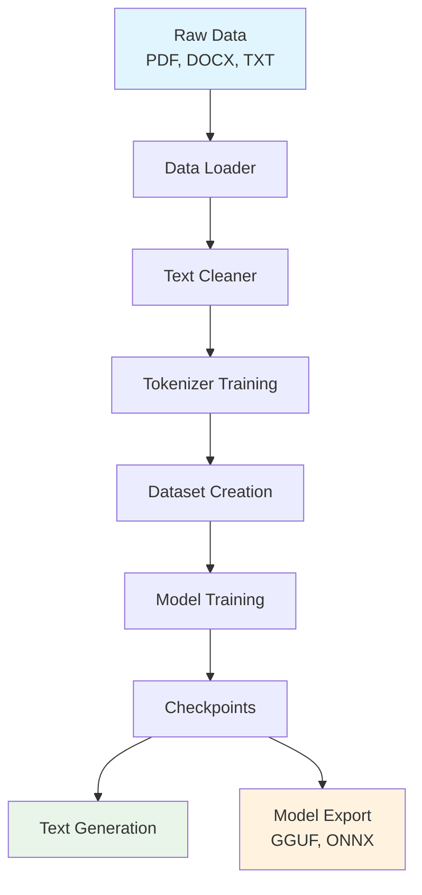

# LLMBuilder Documentation

<div align="center">
  <h1>🤖 LLMBuilder</h1>
  <p><strong>A comprehensive toolkit for building, training, and deploying language models</strong></p>
  
  [](https://badge.fury.io/py/llmbuilder)
  [](https://www.python.org/downloads/)
  [](https://opensource.org/licenses/MIT)
  [](https://github.com/Qubasehq/llmbuilder-package/stargazers)
</div>

---

## What is LLMBuilder?

**LLMBuilder** is a production-ready framework for training and fine-tuning Large Language Models (LLMs) — not a model itself. Designed for developers, researchers, and AI engineers, LLMBuilder provides a complete pipeline to go from raw text data to deployable, optimized LLMs, all running locally on CPUs or GPUs.

### 🎯 Key Features

=== "🚀 Easy to Use"
    - **One-line training**: `llmbuilder train model --data data.txt --output model/`
    - **Interactive CLI**: Guided setup with `llmbuilder welcome`
    - **Python API**: Simple `import llmbuilder as lb` interface
    - **CPU-friendly**: Optimized for local development

=== "🔧 Comprehensive"
    - **Data Processing**: PDF, DOCX, TXT, and more formats
    - **Tokenization**: BPE, Unigram, Word, Character models
    - **Training**: Full GPT-style transformer training
    - **Fine-tuning**: LoRA and full parameter fine-tuning
    - **Export**: GGUF, ONNX, quantized formats

=== "⚡ Performance"
    - **Memory efficient**: Gradient checkpointing and mixed precision
    - **Scalable**: Single GPU to multi-GPU training
    - **Fast inference**: Optimized text generation
    - **Quantization**: 8-bit and 16-bit model compression

=== "🛠️ Developer Friendly"
    - **Modular design**: Use only what you need
    - **Extensive docs**: Complete API reference and examples
    - **Testing**: Comprehensive test suite
    - **Migration**: Easy upgrade from legacy scripts

## Quick Example

```python
import llmbuilder as lb

# Load configuration and build model
cfg = lb.load_config(preset="cpu_small")
model = lb.build_model(cfg.model)

# Train the model
from llmbuilder.data import TextDataset
dataset = TextDataset("./data/clean.txt", block_size=cfg.model.max_seq_length)
results = lb.train_model(model, dataset, cfg.training)

# Generate text
text = lb.generate_text(
    model_path="./checkpoints/model.pt",
    tokenizer_path="./tokenizers",
    prompt="The future of AI is",
    max_new_tokens=50
)
print(text)
```

## Architecture Overview



## Getting Started

Choose your path to get started with LLMBuilder:

<div class="grid cards" markdown>

-   :material-rocket-launch: **Quick Start**

    ---

    Get up and running in 5 minutes with our quick start guide.

    [:octicons-arrow-right-24: Quick Start](getting-started/quickstart.md)

-   :material-download: **Installation**

    ---

    Install LLMBuilder and set up your environment.

    [:octicons-arrow-right-24: Installation](getting-started/installation.md)

-   :material-brain: **First Model**

    ---

    Train your first language model step by step.

    [:octicons-arrow-right-24: First Model](getting-started/first-model.md)

-   :material-book-open: **User Guide**

    ---

    Comprehensive guides for all features and capabilities.

    [:octicons-arrow-right-24: User Guide](user-guide/configuration.md)

</div>

## Use Cases

!!! example "Research & Experimentation"
    Perfect for researchers who need to quickly prototype and experiment with different model architectures, training strategies, and datasets.

!!! example "Educational Projects"
    Ideal for students and educators learning about transformer models, with clear examples and comprehensive documentation.

!!! example "Production Deployment"
    Ready for production use with model export, quantization, and optimization features for deployment at scale.

!!! example "Domain-Specific Models"
    Fine-tune models on your specific domain data for improved performance on specialized tasks.

## Community & Support

- **GitHub**: [Qubasehq/llmbuilder-package](https://github.com/Qubasehq/llmbuilder-package)
- **Issues**: [Report bugs and request features](https://github.com/Qubasehq/llmbuilder-package/issues)
- **Discussions**: [Community discussions](https://github.com/Qubasehq/llmbuilder-package/discussions)
- **Website**: [qubase.in](https://qubase.in)

---

<div align="center">
  <p>Built with ❤️ by <strong>Qub△se</strong></p>
  <p><em>Empowering developers to create amazing AI applications</em></p>
</div>