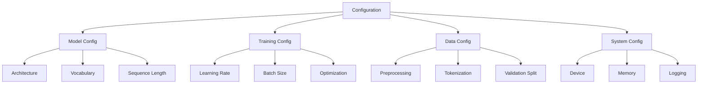

# Configuration

LLMBuilder uses a hierarchical configuration system that makes it easy to customize every aspect of your model training and inference. This guide covers all configuration options and best practices.

## 🎯 Configuration Overview

LLMBuilder configurations are organized into logical sections:



## 📋 Configuration Methods

### Method 1: Using Presets (Recommended)

LLMBuilder comes with optimized presets for different use cases:

```python
import llmbuilder as lb

# Load a preset configuration
config = lb.load_config(preset="cpu_small")
```

Available presets:

| Preset | Use Case | Memory | Parameters | Training Time |
|--------|----------|---------|------------|---------------|
| `tiny` | Testing, debugging | ~500MB | ~1M | Minutes |
| `cpu_small` | CPU training | ~2GB | ~10M | Hours |
| `gpu_medium` | Single GPU | ~8GB | ~50M | Hours |
| `gpu_large` | High-end GPU | ~16GB+ | ~200M+ | Days |
| `inference` | Text generation only | ~1GB | Variable | N/A |

### Method 2: From Configuration File

```python
# Load from JSON file
config = lb.load_config(path="my_config.json")

# Load from YAML file
config = lb.load_config(path="my_config.yaml")
```

### Method 3: Programmatic Configuration

```python
from llmbuilder.config import Config, ModelConfig, TrainingConfig

config = Config(
    model=ModelConfig(
        vocab_size=16000,
        num_layers=12,
        num_heads=12,
        embedding_dim=768,
        max_seq_length=1024,
        dropout=0.1
    ),
    training=TrainingConfig(
        batch_size=16,
        num_epochs=10,
        learning_rate=3e-4,
        warmup_steps=1000
    )
)
```

## 🧠 Model Configuration

### Core Architecture Settings

```json
{
  "model": {
    "vocab_size": 16000,
    "num_layers": 12,
    "num_heads": 12,
    "embedding_dim": 768,
    "max_seq_length": 1024,
    "dropout": 0.1,
    "bias": true,
    "model_type": "gpt"
  }
}
```

#### Parameter Explanations

**`vocab_size`** (int, default: 16000)
: Size of the vocabulary. Must match your tokenizer's vocabulary size.

**`num_layers`** (int, default: 12)
: Number of transformer layers. More layers = more capacity but slower training.

**`num_heads`** (int, default: 12)
: Number of attention heads per layer. Should divide `embedding_dim` evenly.

**`embedding_dim`** (int, default: 768)
: Dimension of token embeddings and hidden states. Larger = more capacity.

**`max_seq_length`** (int, default: 1024)
: Maximum sequence length the model can process. Affects memory usage quadratically.

**`dropout`** (float, default: 0.1)
: Dropout rate for regularization. Higher values prevent overfitting.

### Advanced Model Settings

```json
{
  "model": {
    "activation": "gelu",
    "layer_norm_eps": 1e-5,
    "initializer_range": 0.02,
    "use_cache": true,
    "gradient_checkpointing": false,
    "tie_word_embeddings": true
  }
}
```

**`activation`** (str, default: "gelu")
: Activation function. Options: "gelu", "relu", "swish", "silu".

**`gradient_checkpointing`** (bool, default: false)
: Trade compute for memory. Enables training larger models with less GPU memory.

**`tie_word_embeddings`** (bool, default: true)
: Share input and output embedding weights. Reduces parameters by ~vocab_size * embedding_dim.

## 🏋️ Training Configuration

### Basic Training Settings

```json
{
  "training": {
    "batch_size": 16,
    "num_epochs": 10,
    "learning_rate": 3e-4,
    "weight_decay": 0.01,
    "max_grad_norm": 1.0,
    "warmup_steps": 1000,
    "save_every": 1000,
    "eval_every": 500,
    "log_every": 100
  }
}
```

#### Parameter Explanations

**`batch_size`** (int, default: 16)
: Number of samples per training step. Larger batches are more stable but use more memory.

**`learning_rate`** (float, default: 3e-4)
: Step size for parameter updates. Too high = unstable, too low = slow convergence.

**`weight_decay`** (float, default: 0.01)
: L2 regularization strength. Helps prevent overfitting.

**`max_grad_norm`** (float, default: 1.0)
: Gradient clipping threshold. Prevents exploding gradients.

**`warmup_steps`** (int, default: 1000)
: Number of steps to linearly increase learning rate from 0 to target value.

### Advanced Training Settings

```json
{
  "training": {
    "optimizer": "adamw",
    "scheduler": "cosine",
    "beta1": 0.9,
    "beta2": 0.999,
    "eps": 1e-8,
    "gradient_accumulation_steps": 1,
    "mixed_precision": "fp16",
    "dataloader_num_workers": 4,
    "pin_memory": true
  }
}
```

**`optimizer`** (str, default: "adamw")
: Optimization algorithm. Options: "adamw", "adam", "sgd", "adafactor".

**`scheduler`** (str, default: "cosine")
: Learning rate schedule. Options: "cosine", "linear", "constant", "polynomial".

**`mixed_precision`** (str, default: "fp16")
: Use mixed precision training. Options: "fp16", "bf16", "fp32".

**`gradient_accumulation_steps`** (int, default: 1)
: Accumulate gradients over multiple steps. Effective batch size = batch_size * gradient_accumulation_steps.

## 📊 Data Configuration

```json
{
  "data": {
    "train_split": 0.9,
    "val_split": 0.1,
    "test_split": 0.0,
    "shuffle": true,
    "seed": 42,
    "block_size": 1024,
    "stride": 512,
    "min_length": 10,
    "max_length": null,
    "preprocessing": {
      "lowercase": false,
      "remove_special_chars": false,
      "normalize_whitespace": true,
      "filter_languages": null
    }
  }
}
```

### Data Processing Options

**`block_size`** (int, default: 1024)
: Length of input sequences. Should match model's `max_seq_length`.

**`stride`** (int, default: 512)
: Overlap between consecutive sequences. Larger stride = less overlap = more diverse samples.

**`min_length`** (int, default: 10)
: Minimum sequence length to keep. Filters out very short sequences.

## 🖥️ System Configuration

```json
{
  "system": {
    "device": "auto",
    "num_gpus": 1,
    "distributed": false,
    "compile": false,
    "seed": 42,
    "deterministic": false,
    "benchmark": true,
    "cache_dir": "./cache",
    "output_dir": "./output",
    "logging_level": "INFO"
  }
}
```

### Device and Performance Settings

**`device`** (str, default: "auto")
: Device to use. Options: "auto", "cpu", "cuda", "cuda:0", etc.

**`compile`** (bool, default: false)
: Use PyTorch 2.0 compilation for faster training (experimental).

**`benchmark`** (bool, default: true)
: Enable cuDNN benchmarking for consistent input sizes.

## 🛠️ Creating Custom Configurations

### Using the CLI

```bash
# Interactive configuration creation
llmbuilder config create --interactive

# Create from preset and customize
llmbuilder config create --preset cpu_small --output my_config.json
```

### Programmatic Creation

```python
from llmbuilder.config import Config, ModelConfig, TrainingConfig

# Create custom configuration
config = Config(
    model=ModelConfig(
        vocab_size=32000,  # Larger vocabulary
        num_layers=24,     # Deeper model
        num_heads=16,      # More attention heads
        embedding_dim=1024, # Larger embeddings
        max_seq_length=2048, # Longer sequences
        dropout=0.1
    ),
    training=TrainingConfig(
        batch_size=8,      # Smaller batch for larger model
        num_epochs=20,     # More training
        learning_rate=1e-4, # Lower learning rate
        warmup_steps=2000,  # Longer warmup
        gradient_accumulation_steps=4  # Effective batch size = 32
    )
)

# Save configuration
config.save("custom_config.json")
```

### Configuration Inheritance

```python
# Start with a preset
base_config = lb.load_config(preset="gpu_medium")

# Modify specific settings
base_config.model.num_layers = 18
base_config.training.learning_rate = 1e-4
base_config.training.batch_size = 12

# Save modified configuration
base_config.save("modified_config.json")
```

## 🔧 Configuration Validation

### Automatic Validation

LLMBuilder automatically validates configurations:

```python
config = lb.load_config("my_config.json")
# Validation happens automatically

# Manual validation
from llmbuilder.config import validate_config
is_valid, errors = validate_config(config)
if not is_valid:
    for error in errors:
        print(f"Error: {error}")
```

### CLI Validation

```bash
llmbuilder config validate my_config.json
```

### Common Validation Errors

!!! warning "Common Issues"
    - **`num_heads` doesn't divide `embedding_dim`**: embedding_dim must be divisible by num_heads
    - **`vocab_size` mismatch**: Must match tokenizer vocabulary size
    - **Memory constraints**: batch_size × max_seq_length × embedding_dim too large for available memory
    - **Invalid device**: Specified device not available

## 📈 Performance Tuning

### Memory Optimization

```json
{
  "model": {
    "gradient_checkpointing": true,
    "tie_word_embeddings": true
  },
  "training": {
    "mixed_precision": "fp16",
    "gradient_accumulation_steps": 4,
    "batch_size": 4
  }
}
```

### Speed Optimization

```json
{
  "system": {
    "compile": true,
    "benchmark": true
  },
  "training": {
    "dataloader_num_workers": 8,
    "pin_memory": true
  }
}
```

### Quality Optimization

```json
{
  "model": {
    "num_layers": 24,
    "embedding_dim": 1024,
    "dropout": 0.1
  },
  "training": {
    "learning_rate": 1e-4,
    "warmup_steps": 2000,
    "weight_decay": 0.01
  }
}
```

## 🎯 Configuration Best Practices

### 1. Start with Presets

Always start with a preset that matches your hardware:

```python
# For CPU development
config = lb.load_config(preset="cpu_small")

# For single GPU
config = lb.load_config(preset="gpu_medium")

# For multiple GPUs
config = lb.load_config(preset="gpu_large")
```

### 2. Scale Gradually

When increasing model size, scale parameters proportionally:

```python
# If doubling embedding_dim, consider:
config.model.embedding_dim *= 2
config.model.num_heads *= 2  # Keep head_dim constant
config.training.learning_rate *= 0.7  # Reduce LR for larger models
config.training.warmup_steps *= 2  # Longer warmup
```

### 3. Monitor Memory Usage

```python
# Check memory requirements before training
from llmbuilder.utils import estimate_memory_usage

memory_gb = estimate_memory_usage(config)
print(f"Estimated memory usage: {memory_gb:.1f} GB")
```

### 4. Use Configuration Templates

Create templates for common scenarios:

```python
# templates/research_config.py
def get_research_config(vocab_size, dataset_size):
    """Configuration optimized for research experiments."""
    return Config(
        model=ModelConfig(
            vocab_size=vocab_size,
            num_layers=12 if dataset_size < 1e6 else 24,
            embedding_dim=768,
            max_seq_length=1024,
            dropout=0.1
        ),
        training=TrainingConfig(
            batch_size=16,
            learning_rate=3e-4,
            num_epochs=10 if dataset_size < 1e6 else 20,
            warmup_steps=min(1000, dataset_size // 100)
        )
    )
```

## 🔍 Debugging Configuration Issues

### Enable Verbose Logging

```json
{
  "system": {
    "logging_level": "DEBUG"
  }
}
```

### Check Configuration Summary

```python
config = lb.load_config("my_config.json")
print(config.summary())
```

### Validate Against Hardware

```bash
llmbuilder config validate my_config.json --check-hardware
```

## 📚 Configuration Examples

### Minimal CPU Configuration

```json
{
  "model": {
    "vocab_size": 8000,
    "num_layers": 4,
    "num_heads": 4,
    "embedding_dim": 256,
    "max_seq_length": 512
  },
  "training": {
    "batch_size": 4,
    "num_epochs": 5,
    "learning_rate": 1e-3
  },
  "system": {
    "device": "cpu"
  }
}
```

### High-Performance GPU Configuration

```json
{
  "model": {
    "vocab_size": 32000,
    "num_layers": 24,
    "num_heads": 16,
    "embedding_dim": 1024,
    "max_seq_length": 2048,
    "gradient_checkpointing": true
  },
  "training": {
    "batch_size": 8,
    "num_epochs": 20,
    "learning_rate": 1e-4,
    "mixed_precision": "fp16",
    "gradient_accumulation_steps": 4
  },
  "system": {
    "device": "cuda",
    "compile": true
  }
}
```

### Fine-tuning Configuration

```json
{
  "training": {
    "learning_rate": 5e-5,
    "num_epochs": 3,
    "warmup_steps": 100,
    "weight_decay": 0.01,
    "save_every": 100
  },
  "data": {
    "block_size": 512,
    "stride": 256
  }
}
```

---

!!! tip "Configuration Tips"
    - Always validate your configuration before training
    - Start with presets and modify incrementally
    - Monitor memory usage and adjust batch size accordingly
    - Use gradient accumulation to simulate larger batch sizes
    - Save successful configurations for future use