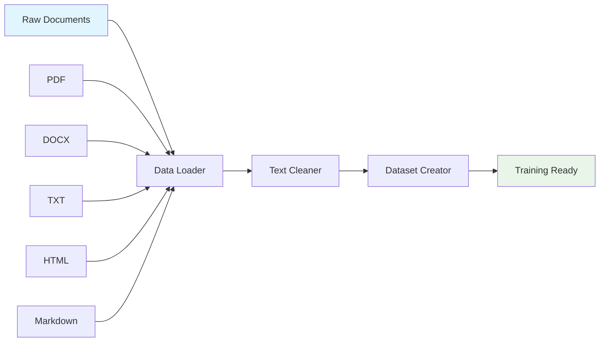

# Data Processing

Data is the foundation of any successful language model. LLMBuilder provides comprehensive tools for loading, cleaning, and preparing text data from various sources. This guide covers everything from basic text files to complex document processing.

## 🎯 Overview

LLMBuilder's data processing pipeline handles:



## 📁 Supported File Formats

LLMBuilder can process various document formats:

| Format | Extension | Description | Quality |
|--------|-----------|-------------|---------|
| Plain Text | `.txt` | Raw text files | ⭐⭐⭐⭐⭐ |
| PDF | `.pdf` | Portable Document Format | ⭐⭐⭐⭐ |
| Word Documents | `.docx` | Microsoft Word documents | ⭐⭐⭐⭐ |
| HTML | `.html`, `.htm` | Web pages | ⭐⭐⭐ |
| Markdown | `.md` | Markdown files | ⭐⭐⭐⭐⭐ |
| PowerPoint | `.pptx` | Presentation slides | ⭐⭐⭐ |
| CSV | `.csv` | Comma-separated values | ⭐⭐⭐ |

## 🚀 Quick Start

### Basic Data Loading

```bash
# Load all supported files from a directory
llmbuilder data load \
  --input ./documents \
  --output clean_text.txt \
  --format all \
  --clean
```

### Python API

```python
from llmbuilder.data import DataLoader

# Initialize data loader
loader = DataLoader(
    min_length=50,      # Filter short texts
    clean_text=True,    # Apply text cleaning
    remove_duplicates=True
)

# Load single file
text = loader.load_file("document.pdf")

# Load directory
texts = loader.load_directory("./documents")

# Combine and save
combined = "\n\n".join(texts)
with open("training_data.txt", "w", encoding="utf-8") as f:
    f.write(combined)
```

## 📄 File Format Specifics

### PDF Processing

PDFs are processed using PyMuPDF for high-quality text extraction:

```python
from llmbuilder.data import DataLoader

loader = DataLoader(
    pdf_options={
        "extract_images": False,    # Skip image text extraction
        "preserve_layout": True,    # Maintain document structure
        "min_font_size": 8,        # Filter small text
        "ignore_headers_footers": True
    }
)

text = loader.load_file("document.pdf")
```

#### PDF Processing Options

```python
pdf_options = {
    "extract_images": False,        # Extract text from images (OCR)
    "preserve_layout": True,        # Keep paragraph structure
    "min_font_size": 8,            # Minimum font size to extract
    "ignore_headers_footers": True, # Skip headers/footers
    "page_range": (1, 10),         # Extract specific pages
    "password": None               # PDF password if needed
}
```

### Word Document Processing

DOCX files are processed with full formatting awareness:

```python
loader = DataLoader(
    docx_options={
        "include_tables": True,     # Extract table content
        "include_headers": False,   # Skip headers
        "include_footers": False,   # Skip footers
        "preserve_formatting": True # Keep basic formatting
    }
)
```

### HTML Processing

HTML content is cleaned and converted to plain text:

```python
loader = DataLoader(
    html_options={
        "remove_scripts": True,     # Remove JavaScript
        "remove_styles": True,      # Remove CSS
        "preserve_links": False,    # Keep link text only
        "extract_tables": True,     # Convert tables to text
        "min_text_length": 20      # Filter short elements
    }
)
```

## 🧹 Text Cleaning

LLMBuilder includes comprehensive text cleaning capabilities:

### Automatic Cleaning

```python
from llmbuilder.data import TextCleaner

cleaner = TextCleaner(
    normalize_whitespace=True,      # Fix spacing issues
    remove_special_chars=False,     # Keep punctuation
    fix_encoding=True,              # Fix encoding issues
    remove_urls=True,               # Remove web URLs
    remove_emails=True,             # Remove email addresses
    remove_phone_numbers=True,      # Remove phone numbers
    min_sentence_length=10,         # Filter short sentences
    max_sentence_length=1000,       # Filter very long sentences
    remove_duplicates=True,         # Remove duplicate sentences
    language_filter="en"            # Keep only English text
)

cleaned_text = cleaner.clean(raw_text)
```

### Custom Cleaning Rules

```python
# Define custom cleaning function
def custom_cleaner(text):
    # Remove specific patterns
    import re
    text = re.sub(r'\[.*?\]', '', text)  # Remove bracketed content
    text = re.sub(r'\d{4}-\d{2}-\d{2}', '', text)  # Remove dates
    return text

# Apply custom cleaning
cleaner = TextCleaner(custom_functions=[custom_cleaner])
cleaned_text = cleaner.clean(raw_text)
```

### Cleaning Statistics

```python
stats = cleaner.get_stats()
print(f"Original length: {stats.original_length:,} characters")
print(f"Cleaned length: {stats.cleaned_length:,} characters")
print(f"Removed: {stats.removed_length:,} characters ({stats.removal_percentage:.1f}%)")
print(f"Sentences: {stats.sentence_count}")
print(f"Paragraphs: {stats.paragraph_count}")
```

## 📊 Dataset Creation

### Basic Dataset Creation

```python
from llmbuilder.data import TextDataset

# Create dataset from text file
dataset = TextDataset(
    data_path="training_data.txt",
    block_size=1024,        # Sequence length
    stride=512,             # Overlap between sequences
    cache_in_memory=True    # Load all data into memory
)

print(f"Dataset size: {len(dataset):,} samples")
```

### Multi-File Dataset

```python
from llmbuilder.data import MultiFileDataset

# Create dataset from multiple files
dataset = MultiFileDataset(
    file_paths=["file1.txt", "file2.txt", "file3.txt"],
    block_size=1024,
    stride=512,
    shuffle_files=True,     # Randomize file order
    max_files=None          # Use all files
)
```

### Dataset Splitting

```python
from llmbuilder.data import split_dataset

# Split dataset into train/validation/test
train_dataset, val_dataset, test_dataset = split_dataset(
    dataset,
    train_ratio=0.8,
    val_ratio=0.1,
    test_ratio=0.1,
    seed=42
)

print(f"Train: {len(train_dataset):,} samples")
print(f"Validation: {len(val_dataset):,} samples")
print(f"Test: {len(test_dataset):,} samples")
```

## 🔄 Data Preprocessing Pipeline

### Complete Pipeline Example

```python
from llmbuilder.data import DataLoader, TextCleaner, TextDataset
from pathlib import Path

def create_training_dataset(input_dir, output_file, block_size=1024):
    """Complete data preprocessing pipeline."""
    
    # Step 1: Load raw data
    print("📁 Loading raw documents...")
    loader = DataLoader(
        min_length=100,
        clean_text=True,
        remove_duplicates=True
    )
    
    texts = []
    input_path = Path(input_dir)
    
    for file_path in input_path.rglob("*"):
        if file_path.suffix.lower() in loader.supported_extensions:
            try:
                text = loader.load_file(file_path)
                if text:
                    texts.append(text)
                    print(f"  ✅ {file_path.name}: {len(text):,} chars")
            except Exception as e:
                print(f"  ❌ {file_path.name}: {e}")
    
    # Step 2: Combine and clean
    print(f"\n🧹 Cleaning {len(texts)} documents...")
    combined_text = "\n\n".join(texts)
    
    cleaner = TextCleaner(
        normalize_whitespace=True,
        remove_urls=True,
        remove_emails=True,
        min_sentence_length=20,
        remove_duplicates=True
    )
    
    cleaned_text = cleaner.clean(combined_text)
    stats = cleaner.get_stats()
    
    print(f"  Original: {stats.original_length:,} characters")
    print(f"  Cleaned: {stats.cleaned_length:,} characters")
    print(f"  Removed: {stats.removal_percentage:.1f}%")
    
    # Step 3: Save processed text
    print(f"\n💾 Saving to {output_file}...")
    with open(output_file, "w", encoding="utf-8") as f:
        f.write(cleaned_text)
    
    # Step 4: Create dataset
    print(f"\n📊 Creating dataset...")
    dataset = TextDataset(
        data_path=output_file,
        block_size=block_size,
        stride=block_size // 2
    )
    
    print(f"  Dataset size: {len(dataset):,} samples")
    print(f"  Sequence length: {block_size}")
    print(f"  Total tokens: {len(dataset) * block_size:,}")
    
    return dataset

# Usage
dataset = create_training_dataset(
    input_dir="./raw_documents",
    output_file="./processed_data.txt",
    block_size=1024
)
```

## 🎛️ Advanced Data Processing

### Streaming Large Datasets

For very large datasets that don't fit in memory:

```python
from llmbuilder.data import StreamingDataset

# Create streaming dataset
dataset = StreamingDataset(
    data_path="huge_dataset.txt",
    block_size=1024,
    buffer_size=10000,      # Number of samples to keep in memory
    shuffle_buffer=1000     # Shuffle buffer size
)

# Use with DataLoader
from torch.utils.data import DataLoader
dataloader = DataLoader(dataset, batch_size=16, num_workers=4)
```

### Custom Data Processing

```python
from llmbuilder.data import BaseDataset

class CustomDataset(BaseDataset):
    """Custom dataset with domain-specific processing."""
    
    def __init__(self, data_path, **kwargs):
        super().__init__(**kwargs)
        self.data = self.load_custom_data(data_path)
    
    def load_custom_data(self, data_path):
        """Load and process data in custom format."""
        # Your custom loading logic here
        pass
    
    def __getitem__(self, idx):
        """Get a single sample."""
        # Your custom sample creation logic
        pass
    
    def __len__(self):
        return len(self.data)
```

### Data Augmentation

```python
from llmbuilder.data import DataAugmenter

augmenter = DataAugmenter(
    synonym_replacement=0.1,    # Replace 10% of words with synonyms
    random_insertion=0.1,       # Insert random words
    random_swap=0.1,           # Swap word positions
    random_deletion=0.1,       # Delete random words
    paraphrase=True            # Generate paraphrases
)

# Augment training data
augmented_texts = []
for text in original_texts:
    augmented = augmenter.augment(text, num_variants=3)
    augmented_texts.extend(augmented)
```

## 📈 Data Quality Assessment

### Quality Metrics

```python
from llmbuilder.data import assess_data_quality

# Analyze data quality
quality_report = assess_data_quality("training_data.txt")

print(f"📊 Data Quality Report:")
print(f"  Total characters: {quality_report.total_chars:,}")
print(f"  Total words: {quality_report.total_words:,}")
print(f"  Total sentences: {quality_report.total_sentences:,}")
print(f"  Average sentence length: {quality_report.avg_sentence_length:.1f} words")
print(f"  Vocabulary size: {quality_report.vocab_size:,}")
print(f"  Duplicate sentences: {quality_report.duplicate_percentage:.1f}%")
print(f"  Language diversity: {quality_report.language_scores}")
print(f"  Readability score: {quality_report.readability_score:.1f}")
```

### Data Visualization

```python
import matplotlib.pyplot as plt
from llmbuilder.data import visualize_data

# Create data visualizations
fig, axes = visualize_data("training_data.txt")

# Sentence length distribution
axes[0].hist(sentence_lengths, bins=50)
axes[0].set_title("Sentence Length Distribution")

# Word frequency
axes[1].bar(top_words, word_counts)
axes[1].set_title("Most Common Words")

plt.tight_layout()
plt.savefig("data_analysis.png")
```

## 🔧 CLI Data Processing

### Interactive Data Processing

```bash
# Interactive data loading with guided setup
llmbuilder data load --interactive
```

This will prompt you for:
- Input directory or file
- Output file path
- File formats to process
- Cleaning options
- Quality filters

### Batch Processing

```bash
# Process multiple directories
llmbuilder data load \
  --input "dir1,dir2,dir3" \
  --output combined_data.txt \
  --format all \
  --clean \
  --min-length 100 \
  --remove-duplicates
```

### Format-Specific Processing

```bash
# Process only PDF files
llmbuilder data load \
  --input ./documents \
  --output pdf_text.txt \
  --format pdf \
  --pdf-extract-images \
  --pdf-min-font-size 10

# Process only Word documents
llmbuilder data load \
  --input ./documents \
  --output docx_text.txt \
  --format docx \
  --docx-include-tables \
  --docx-preserve-formatting
```

## 🚨 Troubleshooting

### Common Issues

#### 1. Encoding Problems

```python
# Handle encoding issues
loader = DataLoader(
    encoding="utf-8",
    fallback_encoding="latin-1",
    fix_encoding=True
)
```

#### 2. Memory Issues with Large Files

```python
# Process large files in chunks
loader = DataLoader(chunk_size=1000000)  # 1MB chunks
texts = loader.load_file_chunked("huge_file.txt")
```

#### 3. Poor Quality Extraction

```python
# Adjust quality thresholds
loader = DataLoader(
    min_length=200,         # Longer minimum length
    max_length=10000,       # Reasonable maximum
    quality_threshold=0.7   # Higher quality threshold
)
```

### Performance Optimization

```python
# Optimize for speed
loader = DataLoader(
    parallel_processing=True,
    num_workers=8,
    cache_processed=True,
    batch_size=1000
)
```

## 📚 Best Practices

### 1. Data Quality Over Quantity

- Clean data is more valuable than large amounts of noisy data
- Remove duplicates and near-duplicates
- Filter out low-quality content

### 2. Diverse Data Sources

- Use multiple document types and sources
- Include different writing styles and domains
- Balance formal and informal text

### 3. Preprocessing Consistency

- Use the same preprocessing pipeline for training and inference
- Document your preprocessing steps
- Version your processed datasets

### 4. Memory Management

- Use streaming datasets for large corpora
- Process data in batches
- Clean up intermediate files

### 5. Quality Monitoring

- Regularly assess data quality
- Monitor for data drift
- Keep preprocessing logs

---

!!! tip "Data Processing Tips"
    - Start with a small sample to test your pipeline
    - Always inspect your processed data manually
    - Keep track of data sources and licenses
    - Use version control for your preprocessing scripts
    - Document any domain-specific preprocessing steps