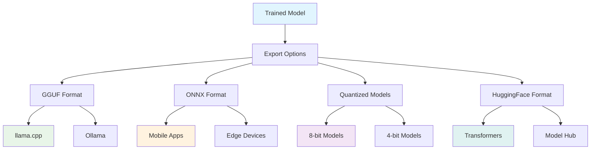

# Model Export

Model export allows you to convert your trained LLMBuilder models into different formats for deployment, optimization, and compatibility with various inference engines. This guide covers all export options and deployment strategies.

## 🎯 Export Overview

LLMBuilder supports multiple export formats for different deployment scenarios:



## 🚀 Quick Start

### CLI Export

```bash
# Export to GGUF format
llmbuilder export gguf \
  ./model/model.pt \
  --output model.gguf \
  --quantization q4_0

# Export to ONNX format
llmbuilder export onnx \
  ./model/model.pt \
  --output model.onnx \
  --opset 11

# Quantize model
llmbuilder export quantize \
  ./model/model.pt \
  --output quantized_model.pt \
  --method dynamic \
  --bits 8
```

### Python API Export

```python
from llmbuilder.export import export_gguf, export_onnx, quantize_model

# Export to GGUF
export_gguf(
    model_path="./model/model.pt",
    output_path="model.gguf",
    quantization="q4_0"
)

# Export to ONNX
export_onnx(
    model_path="./model/model.pt",
    output_path="model.onnx",
    opset_version=11
)

# Quantize model
quantize_model(
    model_path="./model/model.pt",
    output_path="quantized_model.pt",
    method="dynamic",
    bits=8
)
```

## 📦 Export Formats

### 1. GGUF Format

GGUF (GPT-Generated Unified Format) is optimized for CPU inference with llama.cpp:

```python
from llmbuilder.export import GGUFExporter

exporter = GGUFExporter(
    model_path="./model/model.pt",
    tokenizer_path="./tokenizer"
)

# Export with different quantization levels
exporter.export(
    output_path="model_f16.gguf",
    quantization="f16"          # Full precision
)

exporter.export(
    output_path="model_q8.gguf",
    quantization="q8_0"         # 8-bit quantization
)

exporter.export(
    output_path="model_q4.gguf",
    quantization="q4_0"         # 4-bit quantization
)
```

**Quantization Options:**
- `f16`: 16-bit floating point (best quality, larger size)
- `q8_0`: 8-bit quantization (good quality, medium size)
- `q4_0`: 4-bit quantization (lower quality, smallest size)
- `q4_1`: 4-bit with better quality
- `q5_0`, `q5_1`: 5-bit quantization (balanced)

### 2. ONNX Format

ONNX (Open Neural Network Exchange) for cross-platform deployment:

```python
from llmbuilder.export import ONNXExporter

exporter = ONNXExporter(
    model_path="./model/model.pt",
    tokenizer_path="./tokenizer"
)

# Export for different targets
exporter.export(
    output_path="model_cpu.onnx",
    target="cpu",
    opset_version=11,
    optimize=True
)

exporter.export(
    output_path="model_gpu.onnx",
    target="gpu",
    opset_version=14,
    fp16=True
)
```

**ONNX Options:**
- `opset_version`: ONNX operator set version (11, 13, 14)
- `target`: Target device ("cpu", "gpu", "mobile")
- `optimize`: Apply ONNX optimizations
- `fp16`: Use 16-bit precision for GPU

### 3. Quantized PyTorch Models

Quantize models while keeping PyTorch format:

```python
from llmbuilder.export import PyTorchQuantizer

quantizer = PyTorchQuantizer(
    model_path="./model/model.pt"
)

# Dynamic quantization (post-training)
quantizer.dynamic_quantize(
    output_path="model_dynamic_int8.pt",
    dtype="int8"
)

# Static quantization (requires calibration data)
quantizer.static_quantize(
    output_path="model_static_int8.pt",
    calibration_data="calibration_data.txt",
    dtype="int8"
)

# QAT (Quantization Aware Training)
quantizer.qat_quantize(
    output_path="model_qat_int8.pt",
    training_data="training_data.txt",
    epochs=3
)
```

### 4. HuggingFace Format

Export to HuggingFace Transformers format:

```python
from llmbuilder.export import HuggingFaceExporter

exporter = HuggingFaceExporter(
    model_path="./model/model.pt",
    tokenizer_path="./tokenizer"
)

# Export to HuggingFace format
exporter.export(
    output_dir="./huggingface_model",
    model_name="my-llm-model",
    push_to_hub=False,          # Set True to upload to Hub
    private=False
)
```

## ⚙️ Export Configuration

### Advanced Export Settings

```python
from llmbuilder.export import ExportConfig

config = ExportConfig(
    # Model settings
    max_seq_length=2048,        # Maximum sequence length
    vocab_size=32000,           # Vocabulary size
    
    # Quantization settings
    quantization_method="dynamic",
    calibration_samples=1000,
    quantization_bits=8,
    
    # Optimization settings
    optimize_for_inference=True,
    remove_unused_weights=True,
    fuse_operations=True,
    
    # Memory settings
    memory_efficient=True,
    low_cpu_mem_usage=True,
    
    # Metadata
    model_name="MyLLM",
    model_description="Custom language model",
    author="Your Name",
    license="MIT"
)
```

## 🚀 Deployment Scenarios

### 1. CPU Inference with llama.cpp

```bash
# Export to GGUF
llmbuilder export gguf ./model/model.pt --output model.gguf --quantization q4_0

# Use with llama.cpp
./llama.cpp/main -m model.gguf -p "Hello, world!" -n 100
```

### 2. Mobile Deployment with ONNX

```python
# Export optimized for mobile
from llmbuilder.export import export_onnx

export_onnx(
    model_path="./model/model.pt",
    output_path="mobile_model.onnx",
    target="mobile",
    optimize=True,
    fp16=True,
    max_seq_length=512          # Shorter for mobile
)
```

### 3. Cloud Deployment

```python
# Export for cloud inference
from llmbuilder.export import CloudExporter

exporter = CloudExporter(
    model_path="./model/model.pt",
    tokenizer_path="./tokenizer"
)

# AWS SageMaker
exporter.export_sagemaker(
    output_dir="./sagemaker_model",
    instance_type="ml.g4dn.xlarge"
)

# Google Cloud AI Platform
exporter.export_vertex_ai(
    output_dir="./vertex_model",
    machine_type="n1-standard-4"
)

# Azure ML
exporter.export_azure_ml(
    output_dir="./azure_model",
    compute_target="gpu-cluster"
)
```

### 4. Edge Deployment

```python
# Export for edge devices
from llmbuilder.export import EdgeExporter

exporter = EdgeExporter(
    model_path="./model/model.pt",
    tokenizer_path="./tokenizer"
)

# TensorRT for NVIDIA devices
exporter.export_tensorrt(
    output_path="model.trt",
    precision="fp16",
    max_batch_size=1
)

# CoreML for Apple devices
exporter.export_coreml(
    output_path="model.mlmodel",
    target="iOS15"
)

# TensorFlow Lite for mobile
exporter.export_tflite(
    output_path="model.tflite",
    quantize=True
)
```

## 📊 Export Optimization

### Model Size Optimization

```python
from llmbuilder.export import optimize_model_size

# Remove unused parameters
optimized_model = optimize_model_size(
    model_path="./model/model.pt",
    remove_unused=True,
    prune_weights=0.1,          # Prune 10% of smallest weights
    merge_layers=True           # Merge compatible layers
)

# Compare sizes
original_size = get_model_size("./model/model.pt")
optimized_size = get_model_size(optimized_model)
print(f"Size reduction: {(1 - optimized_size/original_size)*100:.1f}%")
```

### Inference Speed Optimization

```python
from llmbuilder.export import optimize_inference_speed

# Optimize for speed
speed_optimized = optimize_inference_speed(
    model_path="./model/model.pt",
    target_device="cpu",
    batch_size=1,
    sequence_length=512,
    fuse_attention=True,
    use_flash_attention=False   # CPU doesn't support flash attention
)
```

### Memory Usage Optimization

```python
from llmbuilder.export import optimize_memory_usage

# Optimize for memory
memory_optimized = optimize_memory_usage(
    model_path="./model/model.pt",
    gradient_checkpointing=True,
    activation_checkpointing=True,
    weight_sharing=True,
    low_memory_mode=True
)
```

## 🔍 Export Validation

### Validate Exported Models

```python
from llmbuilder.export import validate_export

# Validate GGUF export
gguf_validation = validate_export(
    original_model="./model/model.pt",
    exported_model="model.gguf",
    format="gguf",
    test_prompts=["Hello world", "The future of AI"],
    tolerance=0.01              # Acceptable difference in outputs
)

print(f"GGUF validation passed: {gguf_validation.passed}")
print(f"Average difference: {gguf_validation.avg_difference:.4f}")

# Validate ONNX export
onnx_validation = validate_export(
    original_model="./model/model.pt",
    exported_model="model.onnx",
    format="onnx",
    test_prompts=["Hello world", "The future of AI"]
)
```

### Performance Benchmarking

```python
from llmbuilder.export import benchmark_models

# Compare performance across formats
results = benchmark_models([
    ("Original PyTorch", "./model/model.pt"),
    ("GGUF Q4", "model_q4.gguf"),
    ("ONNX", "model.onnx"),
    ("Quantized PyTorch", "model_int8.pt")
], test_prompts=["Benchmark prompt"] * 100)

for name, metrics in results.items():
    print(f"{name}:")
    print(f"  Tokens/sec: {metrics.tokens_per_second:.1f}")
    print(f"  Memory usage: {metrics.memory_mb:.1f} MB")
    print(f"  Model size: {metrics.model_size_mb:.1f} MB")
    print(f"  Latency: {metrics.avg_latency_ms:.1f} ms")
```

## 🚨 Troubleshooting

### Common Export Issues

#### GGUF Export Fails

```python
# Solution: Check model compatibility
from llmbuilder.export import check_gguf_compatibility

compatibility = check_gguf_compatibility("./model/model.pt")
if not compatibility.compatible:
    print(f"Issues: {compatibility.issues}")
    # Fix issues or use alternative export
```

#### ONNX Export Errors

```python
# Solution: Use compatible operations
from llmbuilder.export import fix_onnx_compatibility

fixed_model = fix_onnx_compatibility(
    model_path="./model/model.pt",
    target_opset=11,
    replace_unsupported=True
)
```

#### Quantization Quality Loss

```python
# Solution: Use higher precision or calibration
config = ExportConfig(
    quantization_method="static",  # Better than dynamic
    calibration_samples=5000,      # More calibration data
    quantization_bits=8,           # Higher precision
    preserve_accuracy=True
)
```

### Performance Issues

#### Slow Inference

```python
# Solution: Optimize for target hardware
export_config = ExportConfig(
    optimize_for_inference=True,
    target_device="cpu",           # or "gpu"
    batch_size=1,                  # Optimize for single inference
    fuse_operations=True,
    use_optimized_kernels=True
)
```

#### High Memory Usage

```python
# Solution: Use memory-efficient formats
export_config = ExportConfig(
    quantization_method="dynamic",
    quantization_bits=8,
    memory_efficient=True,
    streaming_weights=True         # Load weights on demand
)
```

## 📚 Best Practices

### 1. Choose the Right Format
- **GGUF**: CPU inference, llama.cpp compatibility
- **ONNX**: Cross-platform, mobile deployment
- **Quantized PyTorch**: PyTorch ecosystem, balanced performance
- **HuggingFace**: Easy sharing, transformers compatibility

### 2. Quantization Strategy
- Start with dynamic quantization for quick wins
- Use static quantization for better quality
- Consider QAT for maximum quality retention
- Test different bit widths (4, 8, 16)

### 3. Validation and Testing
- Always validate exported models
- Test on representative data
- Benchmark performance vs. quality trade-offs
- Verify compatibility with target deployment

### 4. Deployment Considerations
- Consider target hardware capabilities
- Plan for model updates and versioning
- Monitor inference performance in production
- Have fallback options for compatibility issues

---

!!! tip "Export Tips"
    - Always validate exported models before deployment
    - Start with higher precision and reduce if needed
    - Consider the trade-off between model size and quality
    - Test on your target hardware before production deployment
    - Keep the original model for future re-exports with different settings