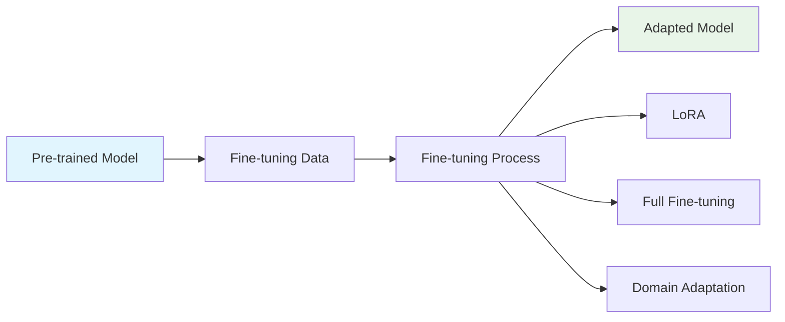

# Fine-tuning

Fine-tuning allows you to adapt pre-trained models to specific domains or tasks. LLMBuilder provides comprehensive fine-tuning capabilities including LoRA, full parameter fine-tuning, and domain adaptation.

## 🎯 Fine-tuning Overview

Fine-tuning is the process of taking a pre-trained model and adapting it to your specific use case:



## 🚀 Quick Start

### CLI Fine-tuning

```bash
llmbuilder finetune model \
  --model ./pretrained_model/model.pt \
  --dataset domain_data.txt \
  --output ./finetuned_model \
  --epochs 5 \
  --lr 5e-5 \
  --use-lora
```

### Python API Fine-tuning

```python
import llmbuilder as lb
from llmbuilder.finetune import FineTuningConfig

# Load pre-trained model
model = lb.load_model("./pretrained_model/model.pt")

# Prepare fine-tuning dataset
from llmbuilder.data import TextDataset
dataset = TextDataset("domain_data.txt", block_size=1024)

# Configure fine-tuning
config = FineTuningConfig(
    num_epochs=5,
    learning_rate=5e-5,
    use_lora=True,
    lora_rank=16
)

# Fine-tune model
results = lb.finetune_model(model, dataset, config)
```

## 🔧 Fine-tuning Methods

### 1. LoRA (Low-Rank Adaptation)

LoRA is efficient and requires less memory:

```python
from llmbuilder.finetune import LoRAConfig

lora_config = LoRAConfig(
    rank=16,                    # LoRA rank (4, 8, 16, 32)
    alpha=32,                   # LoRA alpha (usually 2x rank)
    dropout=0.1,                # LoRA dropout
    target_modules=[            # Which modules to adapt
        "attention.query",
        "attention.key", 
        "attention.value",
        "mlp.dense"
    ]
)

config = FineTuningConfig(
    use_lora=True,
    lora_config=lora_config,
    learning_rate=1e-4,
    num_epochs=10
)
```

**Advantages:**
- Memory efficient (only ~1% of parameters)
- Fast training
- Easy to merge back to base model
- Multiple adapters can be trained

### 2. Full Parameter Fine-tuning

Fine-tune all model parameters:

```python
config = FineTuningConfig(
    use_lora=False,             # Full fine-tuning
    learning_rate=1e-5,         # Lower LR for stability
    num_epochs=3,               # Fewer epochs needed
    weight_decay=0.01,          # Regularization
    warmup_steps=100
)
```

**Advantages:**
- Maximum adaptation capability
- Better performance on very different domains
- Full model customization

**Disadvantages:**
- Requires more memory
- Slower training
- Risk of catastrophic forgetting

### 3. Domain Adaptation

Adapt to specific domains while preserving general capabilities:

```python
config = FineTuningConfig(
    adaptation_method="domain",
    domain_weight=0.7,          # Balance between domain and general
    regularization_strength=0.1, # Prevent forgetting
    learning_rate=3e-5,
    num_epochs=8
)
```

## 📊 Fine-tuning Configuration

### Basic Configuration

```python
from llmbuilder.finetune import FineTuningConfig

config = FineTuningConfig(
    # Training parameters
    num_epochs=5,               # Usually fewer than pre-training
    learning_rate=5e-5,         # Lower than pre-training
    batch_size=8,               # Often smaller due to memory
    
    # Fine-tuning specific
    use_lora=True,              # Use LoRA for efficiency
    freeze_embeddings=False,    # Whether to freeze embeddings
    freeze_layers=0,            # Number of layers to freeze
    
    # Regularization
    weight_decay=0.01,
    dropout_rate=0.1,
    
    # Evaluation
    eval_every=100,
    save_every=500,
    early_stopping_patience=3
)
```

### Advanced Configuration

```python
config = FineTuningConfig(
    # LoRA settings
    lora_rank=16,
    lora_alpha=32,
    lora_dropout=0.1,
    lora_target_modules=["attention", "mlp"],
    
    # Learning rate scheduling
    scheduler="cosine",
    warmup_ratio=0.1,
    min_lr_ratio=0.1,
    
    # Data settings
    max_seq_length=1024,
    data_collator="default",
    
    # Optimization
    optimizer="adamw",
    gradient_accumulation_steps=4,
    max_grad_norm=1.0,
    
    # Memory optimization
    gradient_checkpointing=True,
    dataloader_pin_memory=True,
    dataloader_num_workers=4
)
```

## 🎯 Fine-tuning Strategies

### 1. Task-Specific Fine-tuning

For specific tasks like code generation, question answering, etc.:

```python
# Prepare task-specific data
task_data = """
Question: What is machine learning?
Answer: Machine learning is a subset of artificial intelligence...

Question: How do neural networks work?
Answer: Neural networks are computational models inspired by...
"""

# Configure for task adaptation
config = FineTuningConfig(
    use_lora=True,
    lora_rank=32,               # Higher rank for complex tasks
    learning_rate=1e-4,
    num_epochs=10,
    task_type="question_answering"
)
```

### 2. Domain-Specific Fine-tuning

For specific domains like medical, legal, scientific:

```python
# Medical domain example
config = FineTuningConfig(
    use_lora=True,
    lora_rank=16,
    learning_rate=5e-5,
    num_epochs=15,
    domain="medical",
    preserve_general_knowledge=True,  # Prevent catastrophic forgetting
    domain_weight=0.8
)
```

### 3. Style Fine-tuning

For specific writing styles or formats:

```python
# Creative writing style
config = FineTuningConfig(
    use_lora=True,
    lora_rank=8,                # Lower rank for style changes
    learning_rate=3e-5,
    num_epochs=5,
    style_adaptation=True,
    preserve_factual_knowledge=True
)
```

## 📈 Monitoring Fine-tuning

### Training Metrics

```python
from llmbuilder.finetune import FineTuner

trainer = FineTuner(
    model=model,
    train_dataset=train_dataset,
    val_dataset=val_dataset,
    config=config
)

# Train with monitoring
results = trainer.train()

# Check results
print(f"Base model perplexity: {results.base_perplexity:.2f}")
print(f"Fine-tuned perplexity: {results.final_perplexity:.2f}")
print(f"Improvement: {results.improvement_percentage:.1f}%")
print(f"Training time: {results.training_time}")
```

### Evaluation Metrics

```python
# Evaluate on validation set
eval_results = trainer.evaluate(val_dataset)

print(f"Validation loss: {eval_results.loss:.4f}")
print(f"Perplexity: {eval_results.perplexity:.2f}")
print(f"BLEU score: {eval_results.bleu_score:.3f}")
print(f"Task accuracy: {eval_results.task_accuracy:.3f}")
```

## 🔄 Advanced Techniques

### Progressive Fine-tuning

Gradually unfreeze layers during training:

```python
config = FineTuningConfig(
    progressive_unfreezing=True,
    unfreeze_schedule=[
        (0, 2),     # Epochs 0-2: freeze all but last 2 layers
        (3, 4),     # Epochs 3-4: freeze all but last 4 layers
        (5, -1),    # Epochs 5+: unfreeze all layers
    ],
    learning_rate_schedule=[
        (0, 1e-5),  # Lower LR for frozen layers
        (3, 3e-5),  # Medium LR for partial unfreezing
        (5, 5e-5),  # Higher LR for full unfreezing
    ]
)
```

### Multi-task Fine-tuning

Fine-tune on multiple tasks simultaneously:

```python
from llmbuilder.data import MultiTaskDataset

# Prepare multi-task dataset
dataset = MultiTaskDataset([
    ("qa", qa_dataset, 0.4),        # 40% question answering
    ("summarization", sum_dataset, 0.3),  # 30% summarization
    ("generation", gen_dataset, 0.3),     # 30% text generation
])

config = FineTuningConfig(
    multi_task=True,
    task_weights={"qa": 1.0, "summarization": 0.8, "generation": 1.2},
    shared_encoder=True,
    task_specific_heads=True
)
```

### Continual Learning

Fine-tune while preventing catastrophic forgetting:

```python
config = FineTuningConfig(
    continual_learning=True,
    regularization_method="ewc",    # Elastic Weight Consolidation
    regularization_strength=1000,
    memory_buffer_size=1000,        # Store important examples
    replay_frequency=0.1            # 10% replay during training
)
```

## 🎨 Specialized Fine-tuning

### Code Generation Fine-tuning

```python
# Configure for code generation
config = FineTuningConfig(
    use_lora=True,
    lora_rank=32,
    target_modules=["attention", "mlp"],
    learning_rate=1e-4,
    num_epochs=8,
    
    # Code-specific settings
    max_seq_length=2048,        # Longer sequences for code
    special_tokens=["<code>", "</code>", "<comment>"],
    code_specific_loss=True,
    syntax_aware_training=True
)
```

### Conversational Fine-tuning

```python
# Configure for chat/dialogue
config = FineTuningConfig(
    use_lora=True,
    lora_rank=16,
    learning_rate=5e-5,
    num_epochs=6,
    
    # Conversation-specific
    dialogue_format=True,
    turn_separator="<turn>",
    response_loss_only=True,    # Only compute loss on responses
    max_turns=10
)
```

## 🚨 Troubleshooting

### Common Issues

#### Catastrophic Forgetting

```python
# Solution: Use regularization
config = FineTuningConfig(
    regularization_method="l2",
    regularization_strength=0.01,
    preserve_base_capabilities=True,
    validation_on_base_tasks=True
)
```

#### Overfitting

```python
# Solution: Reduce learning rate and add regularization
config = FineTuningConfig(
    learning_rate=1e-5,         # Lower LR
    weight_decay=0.1,           # Higher weight decay
    dropout_rate=0.2,           # Higher dropout
    early_stopping_patience=2,  # Early stopping
    validation_split=0.2        # More validation data
)
```

#### Poor Task Performance

```python
# Solution: Increase adaptation capacity
config = FineTuningConfig(
    lora_rank=64,               # Higher LoRA rank
    lora_alpha=128,             # Higher alpha
    learning_rate=1e-4,         # Higher LR
    num_epochs=15,              # More epochs
    target_modules="all"        # Adapt more modules
)
```

## 📚 Best Practices

### 1. Data Preparation
- Use high-quality, task-relevant data
- Balance dataset sizes across tasks
- Include diverse examples
- Validate data format and quality

### 2. Hyperparameter Selection
- Start with lower learning rates (1e-5 to 1e-4)
- Use fewer epochs than pre-training (3-10)
- Choose appropriate LoRA rank (8-32)
- Monitor validation metrics closely

### 3. Evaluation Strategy
- Evaluate on both task-specific and general metrics
- Test for catastrophic forgetting
- Use held-out test sets
- Compare against base model performance

### 4. Resource Management
- Use LoRA for memory efficiency
- Enable gradient checkpointing if needed
- Monitor GPU memory usage
- Save checkpoints frequently

---

!!! tip "Fine-tuning Tips"
    - Always start with a smaller learning rate than pre-training
    - Use LoRA for most fine-tuning tasks unless you need maximum adaptation
    - Monitor both task performance and general capabilities
    - Save multiple checkpoints to find the best stopping point
    - Test your fine-tuned model thoroughly before deployment