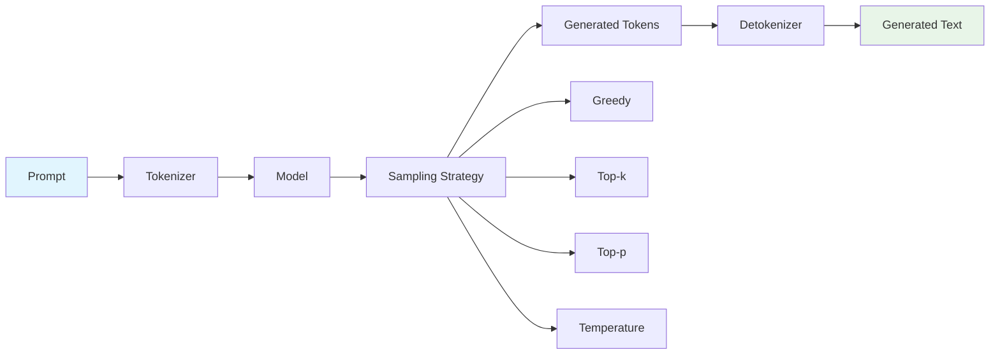

# Text Generation

Text generation is where your trained language model comes to life. LLMBuilder provides powerful and flexible text generation capabilities with various sampling strategies, interactive modes, and customization options.

## 🎯 Generation Overview

Text generation transforms your trained model into a creative writing assistant:



## 🚀 Quick Start

### CLI Generation

```bash
# Interactive generation setup
llmbuilder generate text --setup

# Direct generation
llmbuilder generate text \
  --model ./model/model.pt \
  --tokenizer ./tokenizer \
  --prompt "The future of AI is" \
  --max-tokens 100 \
  --temperature 0.8

# Interactive chat mode
llmbuilder generate text \
  --model ./model/model.pt \
  --tokenizer ./tokenizer \
  --interactive
```

### Python API Generation

```python
import llmbuilder as lb

# Simple generation
text = lb.generate_text(
    model_path="./model/model.pt",
    tokenizer_path="./tokenizer",
    prompt="The future of AI is",
    max_new_tokens=100,
    temperature=0.8
)
print(text)

# Interactive generation
lb.interactive_cli(
    model_path="./model/model.pt",
    tokenizer_path="./tokenizer",
    temperature=0.8
)
```

## ⚙️ Generation Parameters

### Core Parameters

```python
from llmbuilder.inference import GenerationConfig

config = GenerationConfig(
    # Length control
    max_new_tokens=100,         # Maximum tokens to generate
    min_new_tokens=10,          # Minimum tokens to generate
    max_length=1024,            # Total sequence length limit
    
    # Sampling parameters
    temperature=0.8,            # Creativity (0.1-2.0)
    top_k=50,                   # Top-k sampling
    top_p=0.9,                  # Nucleus sampling
    repetition_penalty=1.1,     # Prevent repetition
    
    # Special tokens
    pad_token_id=0,
    eos_token_id=2,
    bos_token_id=1,
    
    # Generation strategy
    do_sample=True,             # Use sampling vs greedy
    num_beams=1,                # Beam search width
    early_stopping=True         # Stop at EOS token
)
```

### Advanced Parameters

```python
config = GenerationConfig(
    # Advanced sampling
    typical_p=0.95,             # Typical sampling
    eta_cutoff=1e-4,            # Eta sampling cutoff
    epsilon_cutoff=1e-4,        # Epsilon sampling cutoff
    
    # Repetition control
    repetition_penalty=1.1,
    no_repeat_ngram_size=3,     # Prevent n-gram repetition
    encoder_repetition_penalty=1.0,
    
    # Length penalties
    length_penalty=1.0,         # Beam search length penalty
    exponential_decay_length_penalty=None,
    
    # Diversity
    num_beam_groups=1,          # Diverse beam search
    diversity_penalty=0.0,
    
    # Stopping criteria
    max_time=None,              # Maximum generation time
    stop_strings=["</s>", "\n\n"],  # Custom stop strings
)
```

## 🎨 Sampling Strategies

### 1. Greedy Decoding

Always choose the most likely token:

```python
config = GenerationConfig(
    do_sample=False,            # Disable sampling
    temperature=1.0,            # Not used in greedy
    top_k=None,                 # Not used in greedy
    top_p=None                  # Not used in greedy
)

text = lb.generate_text(
    model_path="./model/model.pt",
    tokenizer_path="./tokenizer",
    prompt="Machine learning is",
    config=config
)
```

**Use cases:**
- Deterministic output needed
- Factual question answering
- Code generation
- Translation tasks

### 2. Temperature Sampling

Control randomness with temperature:

```python
# Conservative (more predictable)
conservative_config = GenerationConfig(
    temperature=0.3,            # Low temperature
    do_sample=True
)

# Balanced
balanced_config = GenerationConfig(
    temperature=0.8,            # Medium temperature
    do_sample=True
)

# Creative (more diverse)
creative_config = GenerationConfig(
    temperature=1.5,            # High temperature
    do_sample=True
)
```

**Temperature effects:**
- **0.1-0.3**: Very focused, predictable
- **0.5-0.8**: Balanced creativity
- **1.0-1.5**: More creative, diverse
- **1.5+**: Very creative, potentially incoherent

### 3. Top-k Sampling

Sample from top k most likely tokens:

```python
config = GenerationConfig(
    do_sample=True,
    temperature=0.8,
    top_k=40,                   # Consider top 40 tokens
    top_p=None                  # Disable nucleus sampling
)
```

**Top-k values:**
- **1**: Greedy decoding
- **10-20**: Conservative sampling
- **40-100**: Balanced sampling
- **200+**: Very diverse sampling

### 4. Top-p (Nucleus) Sampling

Sample from tokens that make up top p probability mass:

```python
config = GenerationConfig(
    do_sample=True,
    temperature=0.8,
    top_k=None,                 # Disable top-k
    top_p=0.9                   # Use top 90% probability mass
)
```

**Top-p values:**
- **0.1-0.3**: Very focused
- **0.5-0.7**: Balanced
- **0.8-0.95**: Diverse
- **0.95+**: Very diverse

### 5. Combined Sampling

Combine multiple strategies:

```python
config = GenerationConfig(
    do_sample=True,
    temperature=0.8,            # Add randomness
    top_k=50,                   # Limit to top 50 tokens
    top_p=0.9,                  # Within 90% probability mass
    repetition_penalty=1.1      # Reduce repetition
)
```

## 🎯 Generation Modes

### 1. Single Generation

Generate one response to a prompt:

```python
response = lb.generate_text(
    model_path="./model/model.pt",
    tokenizer_path="./tokenizer",
    prompt="Explain quantum computing in simple terms:",
    max_new_tokens=200,
    temperature=0.7
)
```

### 2. Batch Generation

Generate multiple responses:

```python
from llmbuilder.inference import batch_generate

prompts = [
    "The benefits of renewable energy are",
    "Artificial intelligence will help us",
    "The future of space exploration includes"
]

responses = batch_generate(
    model_path="./model/model.pt",
    tokenizer_path="./tokenizer",
    prompts=prompts,
    max_new_tokens=100,
    temperature=0.8,
    batch_size=8
)

for prompt, response in zip(prompts, responses):
    print(f"Prompt: {prompt}")
    print(f"Response: {response}\n")
```

### 3. Interactive Generation

Real-time conversation mode:

```python
from llmbuilder.inference import InteractiveGenerator

generator = InteractiveGenerator(
    model_path="./model/model.pt",
    tokenizer_path="./tokenizer",
    config=GenerationConfig(
        temperature=0.8,
        top_k=50,
        max_new_tokens=150
    )
)

# Start interactive session
generator.start_session()

# Or use in code
while True:
    prompt = input("You: ")
    if prompt.lower() == 'quit':
        break
    
    response = generator.generate(prompt)
    print(f"AI: {response}")
```

### 4. Streaming Generation

Generate text token by token:

```python
from llmbuilder.inference import stream_generate

for token in stream_generate(
    model_path="./model/model.pt",
    tokenizer_path="./tokenizer",
    prompt="The history of artificial intelligence",
    max_new_tokens=200,
    temperature=0.8
):
    print(token, end='', flush=True)
```

## 🔧 Advanced Generation Features

### 1. Prompt Engineering

Optimize prompts for better results:

```python
# System prompt + user prompt
system_prompt = "You are a helpful AI assistant that provides accurate and concise answers."
user_prompt = "Explain machine learning in simple terms."

full_prompt = f"System: {system_prompt}\nUser: {user_prompt}\nAssistant:"

response = lb.generate_text(
    model_path="./model/model.pt",
    tokenizer_path="./tokenizer",
    prompt=full_prompt,
    max_new_tokens=200
)
```

### 2. Few-shot Learning

Provide examples in the prompt:

```python
few_shot_prompt = """
Translate English to French:

English: Hello, how are you?
French: Bonjour, comment allez-vous?

English: What is your name?
French: Comment vous appelez-vous?

English: I love programming.
French:"""

response = lb.generate_text(
    model_path="./model/model.pt",
    tokenizer_path="./tokenizer",
    prompt=few_shot_prompt,
    max_new_tokens=50,
    temperature=0.3  # Lower temperature for translation
)
```

### 3. Constrained Generation

Generate text with constraints:

```python
from llmbuilder.inference import ConstrainedGenerator

# Generate text that must contain certain words
generator = ConstrainedGenerator(
    model_path="./model/model.pt",
    tokenizer_path="./tokenizer",
    required_words=["machine learning", "neural networks", "data"],
    forbidden_words=["impossible", "never"],
    max_length=200
)

response = generator.generate("Explain AI technology:")
```

### 4. Format-Specific Generation

Generate structured output:

```python
# JSON generation
json_prompt = """Generate a JSON object describing a person:
{
  "name": "John Smith",
  "age": 30,
  "occupation": "Software Engineer",
  "skills": ["Python", "JavaScript", "Machine Learning"]
}

Generate a similar JSON for a data scientist:
{"""

response = lb.generate_text(
    model_path="./model/model.pt",
    tokenizer_path="./tokenizer",
    prompt=json_prompt,
    max_new_tokens=150,
    temperature=0.3,
    stop_strings=["}"]
)

# Add closing brace
complete_json = response + "}"
```

## 📊 Generation Quality Control

### 1. Output Filtering

Filter generated content:

```python
from llmbuilder.inference import OutputFilter

filter_config = {
    "min_length": 20,           # Minimum response length
    "max_repetition": 0.3,      # Maximum repetition ratio
    "profanity_filter": True,   # Filter inappropriate content
    "coherence_threshold": 0.7, # Minimum coherence score
    "factuality_check": True    # Basic fact checking
}

filtered_response = OutputFilter.filter(response, filter_config)
```

### 2. Quality Metrics

Evaluate generation quality:

```python
from llmbuilder.inference import evaluate_generation

metrics = evaluate_generation(
    generated_text=response,
    reference_text=None,        # Optional reference
    prompt=prompt
)

print(f"Coherence: {metrics.coherence:.3f}")
print(f"Fluency: {metrics.fluency:.3f}")
print(f"Relevance: {metrics.relevance:.3f}")
print(f"Diversity: {metrics.diversity:.3f}")
print(f"Repetition: {metrics.repetition:.3f}")
```

### 3. A/B Testing

Compare different generation settings:

```python
from llmbuilder.inference import compare_generations

configs = [
    GenerationConfig(temperature=0.7, top_k=40),
    GenerationConfig(temperature=0.8, top_p=0.9),
    GenerationConfig(temperature=0.9, top_k=100, top_p=0.95)
]

results = compare_generations(
    model_path="./model/model.pt",
    tokenizer_path="./tokenizer",
    prompt="Explain the benefits of renewable energy:",
    configs=configs,
    num_samples=10
)

for i, result in enumerate(results):
    print(f"Config {i+1}: Quality={result.avg_quality:.3f}, Diversity={result.avg_diversity:.3f}")
```

## 🎮 Interactive Features

### 1. Chat Interface

Create a chat-like experience:

```python
from llmbuilder.inference import ChatInterface

chat = ChatInterface(
    model_path="./model/model.pt",
    tokenizer_path="./tokenizer",
    system_prompt="You are a helpful AI assistant.",
    config=GenerationConfig(temperature=0.8, max_new_tokens=200)
)

# Start chat session
chat.start()

# Or use programmatically
conversation = []
while True:
    user_input = input("You: ")
    if user_input.lower() == 'quit':
        break
    
    response = chat.respond(user_input, conversation)
    conversation.append({"user": user_input, "assistant": response})
    print(f"AI: {response}")
```

### 2. Creative Writing Assistant

Specialized interface for creative writing:

```python
from llmbuilder.inference import CreativeWriter

writer = CreativeWriter(
    model_path="./model/model.pt",
    tokenizer_path="./tokenizer",
    style="creative",
    config=GenerationConfig(temperature=1.0, top_p=0.95)
)

# Story continuation
story_start = "It was a dark and stormy night when Sarah discovered the mysterious letter..."
continuation = writer.continue_story(story_start, length=300)

# Character development
character = writer.develop_character("a brilliant but eccentric scientist")

# Dialogue generation
dialogue = writer.generate_dialogue("two friends discussing their dreams", turns=6)
```

## 🚨 Troubleshooting

### Common Issues

#### Repetitive Output

```python
# Solution: Adjust repetition penalty and sampling
config = GenerationConfig(
    repetition_penalty=1.2,     # Higher penalty
    no_repeat_ngram_size=3,     # Prevent 3-gram repetition
    temperature=0.9,            # Higher temperature
    top_p=0.9                   # Use nucleus sampling
)
```

#### Incoherent Output

```python
# Solution: Lower temperature and use top-k
config = GenerationConfig(
    temperature=0.6,            # Lower temperature
    top_k=40,                   # Limit choices
    top_p=0.8,                  # Conservative nucleus
    max_new_tokens=100          # Shorter responses
)
```

#### Too Conservative Output

```python
# Solution: Increase temperature and sampling diversity
config = GenerationConfig(
    temperature=1.0,            # Higher temperature
    top_k=100,                  # More choices
    top_p=0.95,                 # Broader nucleus
    repetition_penalty=1.1      # Slight repetition penalty
)
```

#### Slow Generation

```python
# Solution: Optimize for speed
config = GenerationConfig(
    max_new_tokens=50,          # Shorter responses
    do_sample=False,            # Use greedy decoding
    use_cache=True,             # Enable KV cache
    batch_size=1                # Single sample
)

# Use GPU if available
device = "cuda" if torch.cuda.is_available() else "cpu"
```

## 📚 Best Practices

### 1. Parameter Selection
- Start with temperature=0.8, top_k=50, top_p=0.9
- Adjust based on your specific use case
- Lower temperature for factual content
- Higher temperature for creative content

### 2. Prompt Engineering
- Be specific and clear in your prompts
- Use examples for complex tasks
- Include context and constraints
- Test different prompt formats

### 3. Quality Control
- Always validate generated content
- Use appropriate filtering for your use case
- Monitor for bias and inappropriate content
- Test with diverse inputs

### 4. Performance Optimization
- Use appropriate batch sizes
- Enable GPU acceleration when available
- Cache models for repeated use
- Consider quantization for deployment

---

!!! tip "Generation Tips"
    - Experiment with different parameter combinations to find what works best
    - Use lower temperatures for factual tasks and higher for creative tasks
    - Always validate generated content before using in production
    - Consider the trade-off between quality and speed for your use case
    - Keep prompts clear and specific for better results