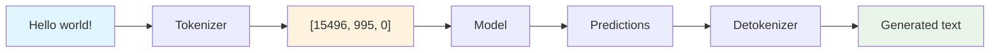

# Tokenization

Tokenization is the process of converting text into numerical tokens that language models can understand. LLMBuilder provides comprehensive tokenization tools with support for multiple algorithms and customization options.

## 🎯 Overview

Tokenization bridges the gap between human text and machine learning:



## 🔤 Tokenization Algorithms

LLMBuilder supports several tokenization algorithms:

### Byte-Pair Encoding (BPE) - Recommended

BPE is the most popular algorithm for language models:

```python
from llmbuilder.tokenizer import TokenizerTrainer
from llmbuilder.config import TokenizerConfig

# Configure BPE tokenizer
config = TokenizerConfig(
    vocab_size=16000,
    model_type="bpe",
    character_coverage=1.0,
    max_sentence_length=4096
)

# Train tokenizer
trainer = TokenizerTrainer(config=config)
trainer.train(
    input_file="training_data.txt",
    output_dir="./tokenizer",
    model_prefix="tokenizer"
)
```

**Advantages:**

- Balances vocabulary size and coverage
- Handles out-of-vocabulary words well
- Works across multiple languages
- Standard for most modern LLMs

### Unigram Language Model

Statistical approach that optimizes vocabulary:

```python
config = TokenizerConfig(
    vocab_size=16000,
    model_type="unigram",
    character_coverage=0.9995,
    unk_token="<unk>",
    bos_token="<s>",
    eos_token="</s>"
)
```

**Advantages:**

- Probabilistically optimal vocabulary
- Better handling of morphologically rich languages
- Flexible subword boundaries

### Word-Level Tokenization

Simple word-based tokenization:

```python
config = TokenizerConfig(
    vocab_size=50000,
    model_type="word",
    lowercase=True,
    remove_accents=True
)
```

**Use cases:**

- Small, domain-specific datasets
- Languages with clear word boundaries
- When interpretability is important

### Character-Level Tokenization

Character-by-character tokenization:

```python
config = TokenizerConfig(
    model_type="char",
    vocab_size=256,  # Usually small for character-level
    normalize=True
)
```

**Use cases:**

- Very small datasets
- Morphologically complex languages
- When dealing with noisy text

## 🚀 Quick Start

### CLI Training

```bash
# Train a BPE tokenizer
llmbuilder data tokenizer \
  --input training_data.txt \
  --output ./tokenizer \
  --vocab-size 16000 \
  --model-type bpe
```

### Python API

```python
from llmbuilder.tokenizer import train_tokenizer

# Train tokenizer with default settings
tokenizer = train_tokenizer(
    input_file="training_data.txt",
    output_dir="./tokenizer",
    vocab_size=16000,
    special_tokens=["<pad>", "<unk>", "<s>", "</s>"]
)

# Test the tokenizer
text = "Hello, world! This is a test."
tokens = tokenizer.encode(text)
decoded = tokenizer.decode(tokens)

print(f"Original: {text}")
print(f"Tokens: {tokens}")
print(f"Decoded: {decoded}")
```

## ⚙️ Configuration Options

### Basic Configuration

```python
from llmbuilder.config import TokenizerConfig

config = TokenizerConfig(
    # Core settings
    vocab_size=16000,           # Vocabulary size
    model_type="bpe",           # Algorithm: bpe, unigram, word, char

    # Text preprocessing
    lowercase=False,            # Convert to lowercase
    remove_accents=False,       # Remove accent marks
    normalize=True,             # Unicode normalization

    # Coverage and quality
    character_coverage=1.0,     # Character coverage (0.0-1.0)
    max_sentence_length=4096,   # Maximum sentence length
    min_frequency=2,            # Minimum token frequency

    # Special tokens
    unk_token="<unk>",         # Unknown token
    bos_token="<s>",           # Beginning of sequence
    eos_token="</s>",          # End of sequence
    pad_token="<pad>",         # Padding token
    mask_token="<mask>",       # Masking token (for MLM)
)
```

### Advanced Configuration

```python
config = TokenizerConfig(
    # Algorithm-specific settings
    bpe_dropout=0.1,           # BPE dropout for regularization
    split_digits=True,         # Split numbers into digits
    split_by_whitespace=True,  # Pre-tokenize by whitespace
    split_by_punctuation=True, # Pre-tokenize by punctuation

    # Vocabulary control
    max_token_length=16,       # Maximum token length
    vocab_threshold=1e-6,      # Vocabulary pruning threshold
    shrinking_factor=0.75,     # Unigram shrinking factor

    # Training control
    num_threads=8,             # Number of training threads
    seed=42,                   # Random seed
    verbose=True               # Verbose training output
)
```

## 🎛️ Special Tokens

Special tokens serve specific purposes in language models:

### Standard Special Tokens

```python
special_tokens = {
    "<pad>": "Padding token for batch processing",
    "<unk>": "Unknown/out-of-vocabulary token",
    "<s>": "Beginning of sequence token",
    "</s>": "End of sequence token",
    "<mask>": "Masking token for masked language modeling"
}

config = TokenizerConfig(
    vocab_size=16000,
    special_tokens=list(special_tokens.keys())
)
```

### Custom Special Tokens

```python
# Add domain-specific special tokens
custom_tokens = [
    "<code>", "</code>",       # Code blocks
    "<math>", "</math>",       # Mathematical expressions
    "<user>", "<assistant>",   # Chat/dialogue markers
    "<system>",                # System messages
    "<tool_call>", "</tool_call>"  # Function calls
]

config = TokenizerConfig(
    vocab_size=16000,
    special_tokens=["<pad>", "<unk>", "<s>", "</s>"] + custom_tokens
)
```

### Token ID Management

```python
# Access special token IDs
tokenizer = train_tokenizer("data.txt", "./tokenizer", config=config)

print(f"PAD token ID: {tokenizer.pad_token_id}")
print(f"UNK token ID: {tokenizer.unk_token_id}")
print(f"BOS token ID: {tokenizer.bos_token_id}")
print(f"EOS token ID: {tokenizer.eos_token_id}")

# Custom token IDs
code_start_id = tokenizer.token_to_id("<code>")
code_end_id = tokenizer.token_to_id("</code>")
```

## 🔍 Tokenizer Analysis

### Vocabulary Analysis

```python
from llmbuilder.tokenizer import analyze_tokenizer

# Analyze trained tokenizer
analysis = analyze_tokenizer("./tokenizer")

print(f"📊 Tokenizer Analysis:")
print(f"  Vocabulary size: {analysis.vocab_size:,}")
print(f"  Average token length: {analysis.avg_token_length:.2f}")
print(f"  Character coverage: {analysis.character_coverage:.4f}")
print(f"  Compression ratio: {analysis.compression_ratio:.2f}")

# Most common tokens
print(f"\n🔤 Most common tokens:")
for token, freq in analysis.top_tokens[:10]:
    print(f"  '{token}': {freq:,}")

# Token length distribution
print(f"\n📏 Token length distribution:")
for length, count in analysis.length_distribution.items():
    print(f"  {length} chars: {count:,} tokens")
```

### Text Coverage Analysis

```python
# Test tokenizer on sample texts
test_texts = [
    "The quick brown fox jumps over the lazy dog.",
    "Artificial intelligence and machine learning.",
    "Code: print('Hello, world!')",
    "Mathematical equation: E = mc²"
]

for text in test_texts:
    tokens = tokenizer.encode(text)
    decoded = tokenizer.decode(tokens)

    print(f"\nText: {text}")
    print(f"Tokens ({len(tokens)}): {tokens}")
    print(f"Decoded: {decoded}")
    print(f"Perfect reconstruction: {text == decoded}")
```

### Compression Analysis

```python
def analyze_compression(tokenizer, text_file):
    """Analyze tokenization compression."""
    with open(text_file, 'r', encoding='utf-8') as f:
        text = f.read()

    # Character count
    char_count = len(text)

    # Token count
    tokens = tokenizer.encode(text)
    token_count = len(tokens)

    # Compression ratio
    compression_ratio = char_count / token_count

    print(f"📊 Compression Analysis:")
    print(f"  Characters: {char_count:,}")
    print(f"  Tokens: {token_count:,}")
    print(f"  Compression ratio: {compression_ratio:.2f}")
    print(f"  Tokens per 1000 chars: {1000 / compression_ratio:.1f}")

    return compression_ratio

# Analyze compression
ratio = analyze_compression(tokenizer, "training_data.txt")
```

## 🔄 Tokenizer Usage

### Basic Encoding/Decoding

```python
from llmbuilder.tokenizer import Tokenizer

# Load trained tokenizer
tokenizer = Tokenizer.from_pretrained("./tokenizer")

# Encode text to tokens
text = "Hello, how are you today?"
tokens = tokenizer.encode(text)
print(f"Tokens: {tokens}")

# Decode tokens back to text
decoded_text = tokenizer.decode(tokens)
print(f"Decoded: {decoded_text}")

# Encode with special tokens
tokens_with_special = tokenizer.encode(
    text,
    add_bos_token=True,  # Add beginning-of-sequence token
    add_eos_token=True   # Add end-of-sequence token
)
print(f"With special tokens: {tokens_with_special}")
```

### Batch Processing

```python
# Encode multiple texts
texts = [
    "First example text.",
    "Second example text.",
    "Third example text."
]

# Batch encode
batch_tokens = tokenizer.encode_batch(texts)
for i, tokens in enumerate(batch_tokens):
    print(f"Text {i+1}: {tokens}")

# Batch decode
batch_decoded = tokenizer.decode_batch(batch_tokens)
for i, text in enumerate(batch_decoded):
    print(f"Decoded {i+1}: {text}")
```

### Padding and Truncation

```python
# Encode with padding and truncation
tokens = tokenizer.encode(
    text,
    max_length=512,      # Maximum sequence length
    padding="max_length", # Pad to max_length
    truncation=True,     # Truncate if longer
    return_attention_mask=True  # Return attention mask
)

print(f"Tokens: {tokens['input_ids']}")
print(f"Attention mask: {tokens['attention_mask']}")
```

## 🎯 Domain-Specific Tokenization

### Code Tokenization

```python
# Configure tokenizer for code
code_config = TokenizerConfig(
    vocab_size=32000,
    model_type="bpe",
    split_by_whitespace=True,
    split_by_punctuation=False,  # Keep operators together
    special_tokens=[
        "<pad>", "<unk>", "<s>", "</s>",
        "<code>", "</code>",
        "<comment>", "</comment>",
        "<string>", "</string>",
        "<number>", "</number>"
    ]
)

# Train on code data
code_tokenizer = train_tokenizer(
    input_file="code_dataset.txt",
    output_dir="./code_tokenizer",
    config=code_config
)
```

### Multilingual Tokenization

```python
# Configure for multiple languages
multilingual_config = TokenizerConfig(
    vocab_size=64000,  # Larger vocab for multiple languages
    model_type="unigram",  # Better for morphologically rich languages
    character_coverage=0.9995,  # High coverage for diverse scripts
    normalize=True,
    special_tokens=[
        "<pad>", "<unk>", "<s>", "</s>",
        "<en>", "<es>", "<fr>", "<de>",  # Language tags
        "<zh>", "<ja>", "<ar>", "<hi>"
    ]
)
```

### Scientific Text Tokenization

```python
# Configure for scientific text
scientific_config = TokenizerConfig(
    vocab_size=24000,
    model_type="bpe",
    split_digits=False,  # Keep numbers together
    special_tokens=[
        "<pad>", "<unk>", "<s>", "</s>",
        "<math>", "</math>",
        "<formula>", "</formula>",
        "<citation>", "</citation>",
        "<table>", "</table>",
        "<figure>", "</figure>"
    ]
)
```

## 🔧 Advanced Features

### Tokenizer Merging

```python
# Merge multiple tokenizers
from llmbuilder.tokenizer import merge_tokenizers

base_tokenizer = Tokenizer.from_pretrained("./base_tokenizer")
domain_tokenizer = Tokenizer.from_pretrained("./domain_tokenizer")

merged_tokenizer = merge_tokenizers(
    [base_tokenizer, domain_tokenizer],
    output_dir="./merged_tokenizer",
    vocab_size=32000
)
```

### Vocabulary Extension

```python
# Extend existing tokenizer vocabulary
new_tokens = ["<new_token_1>", "<new_token_2>", "domain_term"]

extended_tokenizer = tokenizer.extend_vocabulary(
    new_tokens=new_tokens,
    output_dir="./extended_tokenizer"
)

print(f"Original vocab size: {len(tokenizer)}")
print(f"Extended vocab size: {len(extended_tokenizer)}")
```

### Tokenizer Adaptation

```python
# Adapt tokenizer to new domain
adapted_tokenizer = tokenizer.adapt_to_domain(
    domain_data="new_domain_data.txt",
    adaptation_ratio=0.1,  # 10% of vocab from new domain
    output_dir="./adapted_tokenizer"
)
```

## 📊 Performance Optimization

### Fast Tokenization

```python
# Enable fast tokenization
tokenizer = Tokenizer.from_pretrained(
    "./tokenizer",
    use_fast=True,      # Use fast Rust implementation
    num_threads=8       # Parallel processing
)

# Benchmark tokenization speed
import time

text = "Your text here" * 1000  # Large text
start_time = time.time()
tokens = tokenizer.encode(text)
end_time = time.time()

print(f"Tokenization speed: {len(tokens) / (end_time - start_time):.0f} tokens/sec")
```

### Memory Optimization

```python
# Optimize for memory usage
tokenizer = Tokenizer.from_pretrained(
    "./tokenizer",
    low_memory=True,    # Reduce memory usage
    mmap=True          # Memory-map vocabulary files
)
```

### Caching

```python
# Enable tokenization caching
tokenizer.enable_cache(
    cache_dir="./tokenizer_cache",
    max_cache_size="1GB"
)

# Tokenization results will be cached for repeated texts
```

## 🚨 Troubleshooting

### Common Issues

#### 1. Poor Tokenization Quality

```python
# Increase vocabulary size
config.vocab_size = 32000

# Improve character coverage
config.character_coverage = 0.9999

# Adjust minimum frequency
config.min_frequency = 1
```

#### 2. Out-of-Memory During Training

```python
# Reduce training data size
config.max_sentence_length = 1024

# Use fewer threads
config.num_threads = 4

# Process in chunks
trainer.train_chunked(
    input_file="large_data.txt",
    chunk_size=1000000  # 1M characters per chunk
)
```

#### 3. Slow Tokenization

```python
# Use fast tokenizer
tokenizer = Tokenizer.from_pretrained("./tokenizer", use_fast=True)

# Enable parallel processing
tokenizer.enable_parallelism(True)

# Batch process texts
tokens = tokenizer.encode_batch(texts, batch_size=1000)
```

### Validation and Testing

```python
# Validate tokenizer quality
def validate_tokenizer(tokenizer, test_texts):
    """Validate tokenizer on test texts."""
    issues = []

    for text in test_texts:
        tokens = tokenizer.encode(text)
        decoded = tokenizer.decode(tokens)

        if text != decoded:
            issues.append({
                'original': text,
                'decoded': decoded,
                'tokens': tokens
            })

    if issues:
        print(f"⚠️  Found {len(issues)} reconstruction issues:")
        for issue in issues[:5]:  # Show first 5
            print(f"  Original: {issue['original']}")
            print(f"  Decoded:  {issue['decoded']}")
            print()
    else:
        print("✅ All texts reconstructed perfectly!")

    return len(issues) == 0

# Test tokenizer
test_texts = [
    "Hello, world!",
    "The quick brown fox jumps over the lazy dog.",
    "Special characters: @#$%^&*()",
    "Numbers: 123 456.789",
    "Unicode: café naïve résumé"
]

is_valid = validate_tokenizer(tokenizer, test_texts)
```

## 📚 Best Practices

### 1. Vocabulary Size Selection

- **Small datasets (< 1M tokens)**: 8K - 16K vocabulary
- **Medium datasets (1M - 100M tokens)**: 16K - 32K vocabulary
- **Large datasets (> 100M tokens)**: 32K - 64K vocabulary
- **Multilingual**: 64K - 128K vocabulary

### 2. Algorithm Selection

- **BPE**: General purpose, most compatible
- **Unigram**: Better for morphologically rich languages
- **Word**: Simple datasets, interpretability needed
- **Character**: Very small datasets, noisy text

### 3. Special Token Strategy

- Always include `<pad>`, `<unk>`, `<s>`, `</s>`
- Add domain-specific tokens for better performance
- Reserve 5-10% of vocabulary for special tokens
- Use consistent special token formats

### 4. Training Data Quality

- Use the same data distribution as your target task
- Include diverse text types and styles
- Clean data but preserve important patterns
- Ensure sufficient data size (> 1M characters recommended)

### 5. Validation and Testing

- Test on held-out data
- Verify perfect reconstruction for important text types
- Monitor compression ratios
- Check coverage of domain-specific terms

---

!!! tip "Tokenization Tips"
    - Train your tokenizer on the same type of data you'll use for model training
    - Always validate tokenizer quality before training your model
    - Consider the trade-off between vocabulary size and model size
    - Save tokenizer training logs and configurations for reproducibility
    - Test tokenization on edge cases and special characters
