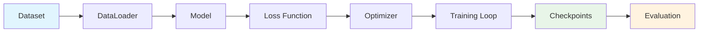

# Model Training

This comprehensive guide covers everything you need to know about training language models with LLMBuilder, from basic concepts to advanced techniques.

## 🎯 Training Overview

LLMBuilder provides a complete training pipeline that handles:



## 🚀 Quick Start Training

### Basic Training Command

```bash
llmbuilder train model \
  --data training_data.txt \
  --tokenizer ./tokenizer \
  --output ./model \
  --epochs 10 \
  --batch-size 16
```

### Python API Training

```python
import llmbuilder as lb

# Load configuration
config = lb.load_config(preset="cpu_small")

# Build model
model = lb.build_model(config.model)

# Prepare dataset
from llmbuilder.data import TextDataset
dataset = TextDataset("training_data.txt", block_size=config.model.max_seq_length)

# Train model
results = lb.train_model(model, dataset, config.training)
```

## ⚙️ Training Configuration

### Core Training Parameters

```python
from llmbuilder.config import TrainingConfig

config = TrainingConfig(
    # Basic settings
    batch_size=16,              # Samples per training step
    num_epochs=10,              # Number of training epochs
    learning_rate=3e-4,         # Learning rate
    
    # Optimization
    optimizer="adamw",          # Optimizer type
    weight_decay=0.01,          # L2 regularization
    max_grad_norm=1.0,          # Gradient clipping
    
    # Learning rate scheduling
    warmup_steps=1000,          # Warmup steps
    scheduler="cosine",         # LR scheduler type
    
    # Checkpointing
    save_every=1000,            # Save checkpoint every N steps
    eval_every=500,             # Evaluate every N steps
    max_checkpoints=5,          # Maximum checkpoints to keep
    
    # Logging
    log_every=100,              # Log every N steps
    wandb_project=None,         # Weights & Biases project
)
```

## 🏋️ Training Process

### Training Loop

The training process follows these steps:

1. **Data Loading**: Load and batch training data
2. **Forward Pass**: Compute model predictions
3. **Loss Calculation**: Calculate training loss
4. **Backward Pass**: Compute gradients
5. **Optimization**: Update model parameters
6. **Evaluation**: Periodic validation
7. **Checkpointing**: Save model state

### Monitoring Training

```python
from llmbuilder.training import Trainer

trainer = Trainer(
    model=model,
    train_dataset=train_dataset,
    val_dataset=val_dataset,
    config=training_config
)

# Train with progress monitoring
results = trainer.train()

print(f"Final training loss: {results.final_train_loss:.4f}")
print(f"Final validation loss: {results.final_val_loss:.4f}")
print(f"Best validation loss: {results.best_val_loss:.4f}")
print(f"Training time: {results.training_time}")
```

## 📊 Advanced Training Techniques

### Mixed Precision Training

```python
config = TrainingConfig(
    mixed_precision="fp16",     # Use 16-bit precision
    gradient_accumulation_steps=4,  # Accumulate gradients
)
```

### Gradient Checkpointing

```python
from llmbuilder.config import ModelConfig

model_config = ModelConfig(
    gradient_checkpointing=True,  # Save memory at cost of compute
    # ... other config
)
```

### Learning Rate Scheduling

```python
config = TrainingConfig(
    scheduler="cosine",         # Cosine annealing
    warmup_steps=2000,         # Linear warmup
    min_lr_ratio=0.1,          # Minimum LR as ratio of max LR
)
```

## 🎯 Training Best Practices

### 1. Data Quality
- Use high-quality, diverse training data
- Remove duplicates and low-quality samples
- Ensure proper text preprocessing

### 2. Hyperparameter Tuning
- Start with proven configurations
- Adjust learning rate based on model size
- Use appropriate batch sizes for your hardware

### 3. Monitoring and Evaluation
- Monitor both training and validation loss
- Use early stopping to prevent overfitting
- Regular checkpointing for recovery

### 4. Hardware Optimization
- Use GPU when available
- Enable mixed precision for faster training
- Optimize batch size for your hardware

## 🚨 Troubleshooting

### Common Training Issues

#### Out of Memory
```python
# Reduce batch size
config.batch_size = 8

# Enable gradient checkpointing
model_config.gradient_checkpointing = True

# Use gradient accumulation
config.gradient_accumulation_steps = 4
```

#### Slow Convergence
```python
# Increase learning rate
config.learning_rate = 5e-4

# Longer warmup
config.warmup_steps = 2000

# Different optimizer
config.optimizer = "adam"
```

#### Unstable Training
```python
# Lower learning rate
config.learning_rate = 1e-4

# Stronger gradient clipping
config.max_grad_norm = 0.5

# Add weight decay
config.weight_decay = 0.1
```

---

!!! tip "Training Tips"
    - Start with small models and scale up gradually
    - Monitor GPU memory usage and adjust batch size accordingly
    - Use validation loss to detect overfitting
    - Save checkpoints frequently during long training runs