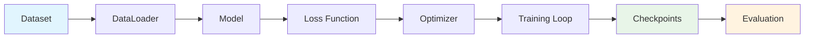

# Model Training

This comprehensive guide covers everything you need to know about training language models with LLMBuilder, from basic concepts to advanced techniques.

## 🎯 Training Overview

LLMBuilder provides a complete training pipeline that handles:



## 🚀 Quick Start Training

### Basic Training Command

```bash
llmbuilder train model \
  --data training_data.txt \
  --tokenizer ./tokenizer \
  --output ./model \
  --epochs 10 \
  --batch-size 16
```

### Python API Training

```python
import llmbuilder as lb

# Load configuration
config = lb.load_config(preset="cpu_small")

# Build model
model = lb.build_model(config.model)

# Prepare dataset
from llmbuilder.data import TextDataset
dataset = TextDataset("training_data.txt", block_size=config.model.max_seq_length)

# Train model
results = lb.train_model(model, dataset, config.training)
```

### Small-Dataset Workflow (Model_Test example)

For tiny datasets (hundreds of tokens), use the bundled example for stable training and easy generation. It uses small-friendly settings (e.g., block_size=64, batch_size=1).

```bash
# Train on the included cybersecurity texts in Model_Test/
python docs/train_model.py --data_dir ./Model_Test --output_dir ./Model_Test/output \
  --epochs 5 --batch_size 1 --block_size 64 --embed_dim 256 --layers 4 --heads 8 \
  --prompt "Cybersecurity is important because"

# Generate again later without retraining
python -c "import llmbuilder; print(llmbuilder.generate_text(\
  model_path=r'.\\Model_Test\\output\\checkpoints\\latest_checkpoint.pt', \
  tokenizer_path=r'.\\Model_Test\\output\\tokenizer', \
  prompt='what is Cybersecurity', max_new_tokens=80, temperature=0.8, top_p=0.9))"
```

Outputs are saved to:

- `Model_Test/output/tokenizer/`
- `Model_Test/output/checkpoints/` (contains latest and epoch checkpoints)

### Full Example Script: `docs/train_model.py`

```python
"""
Example: Train a small GPT model on cybersecurity text files using LLMBuilder.

Usage:
  python docs/train_model.py --data_dir ./Model_Test --output_dir ./Model_Test/output \
      --prompt "Cybersecurity is important because" --epochs 5

If --data_dir is omitted, it defaults to the directory containing this script.
If --output_dir is omitted, it defaults to <data_dir>/output.

This script uses small-friendly settings (block_size=64, batch_size=1) so it
works on tiny datasets. It trains, saves checkpoints, and performs a sample
text generation from the latest/best checkpoint.
"""
from __future__ import annotations
import argparse
from pathlib import Path
import llmbuilder


def main():
    parser = argparse.ArgumentParser(description="Train and generate with LLMBuilder on small text datasets.")
    parser.add_argument("--data_dir", type=str, default=None, help="Directory with .txt files (default: folder of this script)")
    parser.add_argument("--output_dir", type=str, default=None, help="Where to save outputs (default: <data_dir>/output)")
    parser.add_argument("--epochs", type=int, default=5, help="Number of training epochs")
    parser.add_argument("--batch_size", type=int, default=1, help="Training batch size (small data friendly)")
    parser.add_argument("--block_size", type=int, default=64, help="Context window size for training")
    parser.add_argument("--embed_dim", type=int, default=256, help="Model embedding dimension")
    parser.add_argument("--layers", type=int, default=4, help="Number of transformer layers")
    parser.add_argument("--heads", type=int, default=8, help="Number of attention heads")
    parser.add_argument("--lr", type=float, default=6e-4, help="Learning rate")
    parser.add_argument("--prompt", type=str, default="Cybersecurity is important because", help="Prompt for sample generation")
    parser.add_argument("--max_new_tokens", type=int, default=80, help="Tokens to generate")
    parser.add_argument("--temperature", type=float, default=0.8, help="Sampling temperature")
    parser.add_argument("--top_p", type=float, default=0.9, help="Nucleus sampling top_p")
    args = parser.parse_args()

    # Resolve paths
    if args.data_dir is None:
        data_dir = Path(__file__).parent
    else:
        data_dir = Path(args.data_dir)
    output_dir = Path(args.output_dir) if args.output_dir else (data_dir / "output")
    output_dir.mkdir(parents=True, exist_ok=True)

    print(f"Data directory: {data_dir}")
    print(f"Output directory: {output_dir}")

    # Configs mapped to llmbuilder expected keys
    config = {
        # tokenizer/dataset convenience
        "vocab_size": 8000,
        "block_size": int(args.block_size),
        # training config -> llmbuilder.config.TrainingConfig
        "training": {
            "batch_size": int(args.batch_size),
            "learning_rate": float(args.lr),
            "num_epochs": int(args.epochs),
            "max_grad_norm": 1.0,
            "save_every": 1,
            "log_every": 10,
        },
        # model config -> llmbuilder.config.ModelConfig
        "model": {
            "embedding_dim": int(args.embed_dim),
            "num_layers": int(args.layers),
            "num_heads": int(args.heads),
            "max_seq_length": int(args.block_size),
            "dropout": 0.1,
        },
    }

    print("Starting LLMBuilder training pipeline...")
    _pipeline = llmbuilder.train(
        data_path=str(data_dir),
        output_dir=str(output_dir),
        config=config,
        clean=False,
    )

    # Generation
    best_ckpt = output_dir / "checkpoints" / "best_checkpoint.pt"
    latest_ckpt = output_dir / "checkpoints" / "latest_checkpoint.pt"
    model_ckpt = best_ckpt if best_ckpt.exists() else latest_ckpt
    tokenizer_dir = output_dir / "tokenizer"

    if model_ckpt.exists() and tokenizer_dir.exists():
        print("\nGenerating sample text with trained model...")
        text = llmbuilder.generate_text(
            model_path=str(model_ckpt),
            tokenizer_path=str(tokenizer_dir),
            prompt=args.prompt,
            max_new_tokens=int(args.max_new_tokens),
            temperature=float(args.temperature),
            top_p=float(args.top_p),
        )
        print("\nSample generation:\n" + text)
    else:
        print("\nSkipping generation because artifacts were not found.")


if __name__ == "__main__":
    main()
```

## ⚙️ Training Configuration

### Core Training Parameters

```python
from llmbuilder.config import TrainingConfig

config = TrainingConfig(
    # Basic settings
    batch_size=16,              # Samples per training step
    num_epochs=10,              # Number of training epochs
    learning_rate=3e-4,         # Learning rate

    # Optimization
    optimizer="adamw",          # Optimizer type
    weight_decay=0.01,          # L2 regularization
    max_grad_norm=1.0,          # Gradient clipping

    # Learning rate scheduling
    warmup_steps=1000,          # Warmup steps
    scheduler="cosine",         # LR scheduler type

    # Checkpointing
    save_every=1000,            # Save checkpoint every N steps
    eval_every=500,             # Evaluate every N steps
    max_checkpoints=5,          # Maximum checkpoints to keep

    # Logging
    log_every=100,              # Log every N steps
    wandb_project=None,         # Weights & Biases project
)
```

## 🏋️ Training Process

### Training Loop

The training process follows these steps:

1. **Data Loading**: Load and batch training data
2. **Forward Pass**: Compute model predictions
3. **Loss Calculation**: Calculate training loss
4. **Backward Pass**: Compute gradients
5. **Optimization**: Update model parameters
6. **Evaluation**: Periodic validation
7. **Checkpointing**: Save model state

### Monitoring Training

```python
from llmbuilder.training import Trainer

trainer = Trainer(
    model=model,
    train_dataset=train_dataset,
    val_dataset=val_dataset,
    config=training_config
)

# Train with progress monitoring
results = trainer.train()

print(f"Final training loss: {results.final_train_loss:.4f}")
print(f"Final validation loss: {results.final_val_loss:.4f}")
print(f"Best validation loss: {results.best_val_loss:.4f}")
print(f"Training time: {results.training_time}")
```

## 📊 Advanced Training Techniques

### Mixed Precision Training

```python
config = TrainingConfig(
    mixed_precision="fp16",     # Use 16-bit precision
    gradient_accumulation_steps=4,  # Accumulate gradients
)
```

### Gradient Checkpointing

```python
from llmbuilder.config import ModelConfig

model_config = ModelConfig(
    gradient_checkpointing=True,  # Save memory at cost of compute
    # ... other config
)
```

### Learning Rate Scheduling

```python
config = TrainingConfig(
    scheduler="cosine",         # Cosine annealing
    warmup_steps=2000,         # Linear warmup
    min_lr_ratio=0.1,          # Minimum LR as ratio of max LR
)
```

## 🎯 Training Best Practices

### 1. Data Quality

- Use high-quality, diverse training data
- Remove duplicates and low-quality samples
- Ensure proper text preprocessing

### 2. Hyperparameter Tuning

- Start with proven configurations
- Adjust learning rate based on model size
- Use appropriate batch sizes for your hardware

### 3. Monitoring and Evaluation

- Monitor both training and validation loss
- Use early stopping to prevent overfitting
- Regular checkpointing for recovery

### 4. Hardware Optimization

- Use GPU when available
- Enable mixed precision for faster training
- Optimize batch size for your hardware

## 🚨 Troubleshooting

### Common Training Issues

#### Out of Memory

```python
# Reduce batch size
config.batch_size = 8

# Enable gradient checkpointing
model_config.gradient_checkpointing = True

# Use gradient accumulation
config.gradient_accumulation_steps = 4
```

#### Slow Convergence

```python
# Increase learning rate
config.learning_rate = 5e-4

# Longer warmup
config.warmup_steps = 2000

# Different optimizer
config.optimizer = "adam"
```

#### Unstable Training

```python
# Lower learning rate
config.learning_rate = 1e-4

# Stronger gradient clipping
config.max_grad_norm = 0.5

# Add weight decay
config.weight_decay = 0.1
```

---

!!! tip "Training Tips"
    - Start with small models and scale up gradually
    - Monitor GPU memory usage and adjust batch size accordingly
    - Use validation loss to detect overfitting
    - Save checkpoints frequently during long training runs
